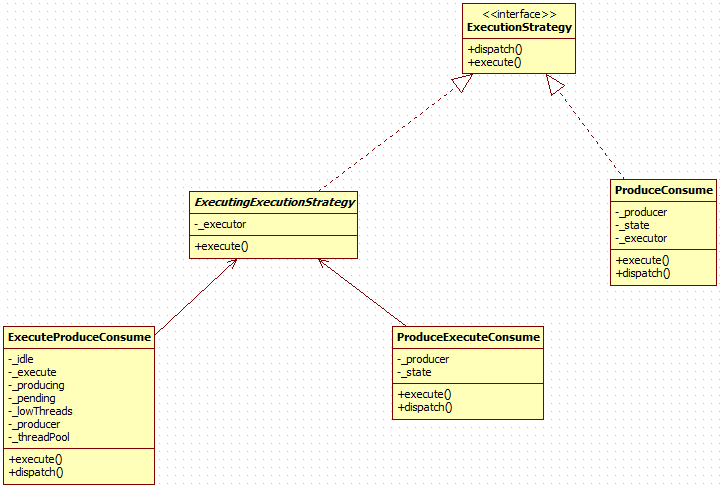
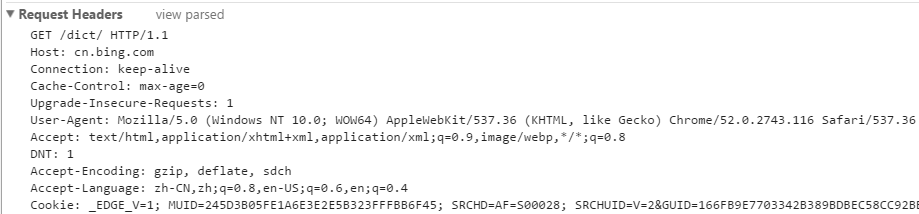
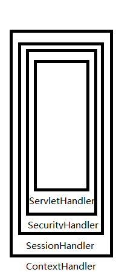

# Jetty启动流程

## Server构造器

 ### 线程池

首先执行设置线程池的构造器，源码如下:

```java
public Server(@Name("threadpool") ThreadPool pool) {
	_threadPool=pool!=null?pool:new QueuedThreadPool();
    addBean(_threadPool);
    setServer(this);
}
```

当然，此处默认传过来 的参数为null，其默认构造器源码:

```java
public QueuedThreadPool() {
	this(200);
}
```

最终调用的构造器如下:

```java
public QueuedThreadPool(@Name("maxThreads") int maxThreads, @Name("minThreads") int minThreads, @Name("idleTimeout") int idleTimeout, @Name("queue") BlockingQueue<Runnable> queue, @Name("threadGroup") ThreadGroup threadGroup) {
  	//默认8
	setMinThreads(minThreads);
  	//默认200
  	setMaxThreads(maxThreads);
  	//默认60000
  	setIdleTimeout(idleTimeout);
  	setStopTimeout(5000);
	//默认null
  	if (queue==null) {
    	int capacity=Math.max(_minThreads, 8);
      	//此类也是jetty的，第一个参数表示起始值，第二个表示每次扩容的值
    	queue=new BlockingArrayQueue<>(capacity, capacity);
  	}
  	_jobs=queue;
  	//null
  	_threadGroup=threadGroup;
}
```

### addBean(LifeCycle)(TODO)

再回到Server构造器，addBean方法用于管理LifeCycle，这里先挖个坑。。。

### setServer

setServer最终将本身对象保存到Server的父类AbstractHandler中。

### Connector构造

Jetty Connector用于接收客户端连接，我们可以添加多个Connector，比如一个用于接收http连接，一个接收https连接，这样可以实现一个jetty用于多个服务。

```java
public Server(@Name("port")int port) {
	this((ThreadPool)null);
    ServerConnector connector=new ServerConnector(this);
    connector.setPort(port);
    setConnectors(new Connector[]{connector});
}
```

#### ServerConnector构造器

```java
public ServerConnector(@Name("server") Server server) {
	this(server,null,null,null,-1,-1,new HttpConnectionFactory());
}
public ServerConnector(
	@Name("server") Server server,
	@Name("executor") Executor executor,
	@Name("scheduler") Scheduler scheduler,
	@Name("bufferPool") ByteBufferPool bufferPool,
	@Name("acceptors") int acceptors,
	@Name("selectors") int selectors,
	@Name("factories") ConnectionFactory... factories) {
	super(server,executor,scheduler,bufferPool,acceptors,factories);
	_manager = new ServerConnectorManager(getExecutor(), getScheduler(), 
		selectors>0?selectors:Math.max(1,Math.min(4,Runtime.getRuntime().availableProcessors()/2)));
	addBean(_manager, true);
}
```

#### AbstractConnector构造器

```java
public AbstractConnector(
		Server server,
		Executor executor,
		Scheduler scheduler,
		ByteBufferPool pool,
		int acceptors,
		ConnectionFactory... factories)
{
	_server=server;
  	//默认使用Server的线程池，也就是QueuedThreadPool
	_executor=executor!=null?executor:_server.getThreadPool();
	if (scheduler==null)
		scheduler=_server.getBean(Scheduler.class);
  	//默认为空
	_scheduler=scheduler!=null?scheduler:new ScheduledExecutorScheduler();
	if (pool==null)
		pool=_server.getBean(ByteBufferPool.class);
  	//默认为空
	_byteBufferPool = pool!=null?pool:new ArrayByteBufferPool();

  	//Connector也实现了Container接口
	addBean(_server,false);
	addBean(_executor);
	if (executor==null)
		unmanage(_executor); // inherited from server
	addBean(_scheduler);
	addBean(_byteBufferPool);

	for (ConnectionFactory factory:factories)
      	//map
		addConnectionFactory(factory);

	int cores = Runtime.getRuntime().availableProcessors();
  	//-1
	if (acceptors < 0)
		acceptors=Math.max(1, Math.min(4,cores/8));        
	if (acceptors > cores)
		LOG.warn("Acceptors should be <= availableProcessors: " + this);
	_acceptors = new Thread[acceptors];
}
```

#### ServerConnectorManager(_manager)初始化

ServerConnectorManager为ServerConnector的内部类

```java
protected SelectorManager(Executor executor, Scheduler scheduler, int selectors)
{
  	//一般为4
	if (selectors <= 0)
		throw new IllegalArgumentException("No selectors");
	this.executor = executor;
	this.scheduler = scheduler;
	_selectors = new ManagedSelector[selectors];
}
```


## 设置handler

源码(HandlerWrapper.setHandler)如下:

```java
public void setHandler(Handler handler) {
	if (isStarted())
		throw new IllegalStateException(STARTED);

     if (handler!=null)
        handler.setServer(getServer());
        
     Handler old=_handler;
     _handler=handler;
     updateBean(old,_handler);
}
```

可见，**每一个handler都保有Server的引用**。

updateBean仍然是LifeCycle的管理。

## start

AbstractLifeCycle.start:

```java
@Override
public final void start() throws Exception {
	synchronized (_lock) {
    	try {
			if (_state == __STARTED || _state == __STARTING)
				return;
			setStarting();
            doStart();
            setStarted();
        } catch (Throwable e) {
			setFailed(e);
			throw e;
		}
	}
}
```

### setStarting

```java
private void setStarting() {
	if (LOG.isDebugEnabled())
		LOG.debug("starting {}",this);
  	//设置内部状态，防止重复启动
	_state = __STARTING;
  	//触发事件监听
	for (Listener listener : _listeners)
		listener.lifeCycleStarting(this);
}
```

_listeners是一个CopyOnWriteArrayList类型的链表，所谓的addLifeCycleListener就是向这里面添加监听器。

#### LifeCycle接口定义

LifeCycle及Listener接口的定义如下:

```java
public interface LifeCycle {
    /* ------------------------------------------------------------ */
    /**
     * Starts the component.
     * @throws Exception If the component fails to start
     * @see #isStarted()
     * @see #stop()
     * @see #isFailed()
     */
    @ManagedOperation(value="Starts the instance", impact="ACTION")
    public void start()
        throws Exception;

    /* ------------------------------------------------------------ */
    /**
     * Stops the component.
     * The component may wait for current activities to complete
     * normally, but it can be interrupted.
     * @exception Exception If the component fails to stop
     * @see #isStopped()
     * @see #start()
     * @see #isFailed()
     */
    @ManagedOperation(value="Stops the instance", impact="ACTION")
    public void stop()
        throws Exception;

    /* ------------------------------------------------------------ */
    /**
     * @return true if the component is starting or has been started.
     */
    public boolean isRunning();

    /* ------------------------------------------------------------ */
    /**
     * @return true if the component has been started.
     * @see #start()
     * @see #isStarting()
     */
    public boolean isStarted();

    /* ------------------------------------------------------------ */
    /**
     * @return true if the component is starting.
     * @see #isStarted()
     */
    public boolean isStarting();

    /* ------------------------------------------------------------ */
    /**
     * @return true if the component is stopping.
     * @see #isStopped()
     */
    public boolean isStopping();

    /* ------------------------------------------------------------ */
    /**
     * @return true if the component has been stopped.
     * @see #stop()
     * @see #isStopping()
     */
    public boolean isStopped();

    /* ------------------------------------------------------------ */
    /**
     * @return true if the component has failed to start or has failed to stop.
     */
    public boolean isFailed();
    
    /* ------------------------------------------------------------ */
    public void addLifeCycleListener(LifeCycle.Listener listener);

    /* ------------------------------------------------------------ */
    public void removeLifeCycleListener(LifeCycle.Listener listener);
    

    /* ------------------------------------------------------------ */
    /** Listener.
     * A listener for Lifecycle events.
     */
    public interface Listener extends EventListener {
        public void lifeCycleStarting(LifeCycle event);
        public void lifeCycleStarted(LifeCycle event);
        public void lifeCycleFailure(LifeCycle event,Throwable cause);
        public void lifeCycleStopping(LifeCycle event);
        public void lifeCycleStopped(LifeCycle event);
    }
}
```

#### 内部状态保存

```java
private final int __FAILED = -1, __STOPPED = 0, __STARTING = 1, __STARTED = 2, __STOPPING = 3;
private volatile int _state = __STOPPED;
```

### Server.doStart

```java
@Override
protected void doStart() throws Exception
{
	//If the Server should be stopped when the jvm exits, register
	//with the shutdown handler thread.
	if (getStopAtShutdown())
		ShutdownThread.register(this);

	//Register the Server with the handler thread for receiving
	//remote stop commands
	ShutdownMonitor.register(this);
	
	//Start a thread waiting to receive "stop" commands.
	ShutdownMonitor.getInstance().start(); // initialize

	LOG.info("jetty-" + getVersion());
	HttpGenerator.setJettyVersion(HttpConfiguration.SERVER_VERSION);
	MultiException mex=new MultiException();

	// check size of thread pool
	SizedThreadPool pool = getBean(SizedThreadPool.class);
	int max=pool==null?-1:pool.getMaxThreads();
	int selectors=0;
	int acceptors=0;
	if (mex.size()==0)
	{
		for (Connector connector : _connectors)
		{
			if (connector instanceof AbstractConnector)
				acceptors+=((AbstractConnector)connector).getAcceptors();
			//默认是这个
			if (connector instanceof ServerConnector)
				selectors+=((ServerConnector)connector).getSelectorManager().getSelectorCount();
		}
	}

	int needed=1+selectors+acceptors;
	if (max>0 && needed>max)
		throw new IllegalStateException(String.format("Insufficient threads: max=%d < needed(acceptors=%d + selectors=%d + request=1)",max,acceptors,selectors));
	
	try
	{
		super.doStart();
	}
	catch(Throwable e)
	{
		mex.add(e);
	}

	// start connectors last
	for (Connector connector : _connectors)
	{
		try
		{   
			connector.start();
		}
		catch(Throwable e)
		{
			mex.add(e);
		}
	}
	
	if (isDumpAfterStart())
		dumpStdErr();

	mex.ifExceptionThrow();

	LOG.info(String.format("Started @%dms",Uptime.getUptime()));
}
```

#### stopAtShutdown

这其实是在向jvm添加一个关闭钩子，在jvm退出时优雅的关闭线程。

ShutdownThread.register:

```java
public static synchronized void register(LifeCycle... lifeCycles) {
  	//_lifeCycles其实就是一个链表
	_thread._lifeCycles.addAll(Arrays.asList(lifeCycles));
    if (_thread._lifeCycles.size()>0)
    	_thread.hook();
}
```

当jvm退出时, ShutdowThread.run:

```java
@Override
public void run()
{
	for (LifeCycle lifeCycle : _thread._lifeCycles)
	{
		try
		{
			if (lifeCycle.isStarted())
			{
				lifeCycle.stop();
				LOG.debug("Stopped {}",lifeCycle);
			}

			if (lifeCycle instanceof Destroyable)
			{
				((Destroyable)lifeCycle).destroy();
				LOG.debug("Destroyed {}",lifeCycle);
			}
		}
		catch (Exception ex)
		{
			LOG.debug(ex);
		}
	}
}
```

#### ShutdownMonitor

用于监听输入的命令，不在赘述。

### 容器启动(ContainerLifeCycle)

```java
/**
 * Starts the managed lifecycle beans in the order they were added.
 */
@Override
protected void doStart() throws Exception
{
	// indicate that we are started, so that addBean will start other beans added.
	_doStarted = true;

	// start our managed and auto beans
	for (Bean b : _beans)
	{
		if (b._bean instanceof LifeCycle)
		{
			LifeCycle l = (LifeCycle)b._bean;
			switch(b._managed)
			{
				case MANAGED:
					if (!l.isRunning())
						start(l);
					break;
				case AUTO:
					if (l.isRunning())
						unmanage(b);
					else
					{
						manage(b);
						start(l);
					}
					break;
			}
		}
	}

	super.doStart();
}
```

#### threadPool

从Server的构造器源码可以看出，threadPool被以bean的形式加入到Server中进行管理。

QueuedThreadPool.doStart:

```java
@Override
protected void doStart() throws Exception {
	super.doStart();
    _threadsStarted.set(0);

    startThreads(_minThreads);
}
```

####  Container & Listener接口

ContainerLifeCycle实现了Container接口，接口源码:

```java
public interface Container
{
    /* ------------------------------------------------------------ */
    /**
     * Add a bean.  If the bean is-a {@link Listener}, then also do an implicit {@link #addEventListener(Listener)}.
     * @param o the bean object to add
     * @return true if the bean was added, false if it was already present
     */
    public boolean addBean(Object o);

    /**
     * @return the list of beans known to this aggregate
     * @see #getBean(Class)
     */
    public Collection<Object> getBeans();

    /**
     * @param clazz the class of the beans
     * @return the list of beans of the given class (or subclass)
     * @param <T> the Bean type
     * @see #getBeans()
     */
    public <T> Collection<T> getBeans(Class<T> clazz);

    /**
     * @param clazz the class of the bean
     * @return the first bean of a specific class (or subclass), or null if no such bean exist
     * @param <T> the Bean type 
     */
    public <T> T getBean(Class<T> clazz);

    /**
     * Removes the given bean.
     * If the bean is-a {@link Listener}, then also do an implicit {@link#removeEventListener(Listener)}.
     * @param o the bean to remove
     * @return whether the bean was removed
     */
    public boolean removeBean(Object o);
    
    /**
     * Add an event listener. 
     * @see Container#addBean(Object)
     * @param listener the listener to add
     */
    public void addEventListener(Listener listener);
    
    /**
     * Remove an event listener. 
     * @see Container#removeBean(Object)
     * @param listener the listener to remove
     */
    public void removeEventListener(Listener listener);

    /**
     * A listener for Container events.
     * If an added bean implements this interface it will receive the events
     * for this container.
     */
    public interface Listener
    {
        void beanAdded(Container parent,Object child);
        void beanRemoved(Container parent,Object child);
    }
    
    /**
     * Inherited Listener.
     * If an added bean implements this interface, then it will 
     * be added to all contained beans that are themselves Containers
     */
    public interface InheritedListener extends Listener
    {
    }
}
```

#### Bean接口

是定义在ContainerLifeCycle内的一个类，**起到包装被管理对象及其状态**的作用。

### Server.start

#### Connector启动

和Server一样，ServerConnector也是AbstractLifeCycle的子类，所以真正的start仍然在各子类的doStart中。

##### AbstractLifeCycle.start

触发LifeCycle.Listener监听并开启doStart调用链。

##### ServerConnector.doStart

```java
@Override
protected void doStart() throws Exception {
	super.doStart();
	//不为0
    if (getAcceptors()==0) {
		_acceptChannel.configureBlocking(false);
        _manager.acceptor(_acceptChannel);
	}
}
```

##### AbstractNetworkConnector.doStart

```java
@Override
protected void doStart() throws Exception {
	open();
    super.doStart();
}
```

ServerConnector.open:

```java
@Override
public void open() throws IOException
{
  	//默认null
	if (_acceptChannel == null)
	{
		ServerSocketChannel serverChannel = null;
      	//默认false
      	//Unix系统上专用，可以参见:
      	//http://stackoverflow.com/questions/14180353/whats-use-of-inheritedchannel-method-in-system-class
		if (isInheritChannel())
		{
			Channel channel = System.inheritedChannel();
			if (channel instanceof ServerSocketChannel)
				serverChannel = (ServerSocketChannel)channel;
			else
				LOG.warn("Unable to use System.inheritedChannel() [{}]. Trying a new ServerSocketChannel at {}:{}", channel, getHost(), getPort());
		}

		if (serverChannel == null)
		{
			serverChannel = ServerSocketChannel.open();

			InetSocketAddress bindAddress = getHost() == null ? new InetSocketAddress(getPort()) : new InetSocketAddress(getHost(), getPort());
          	//默认true，意义参见源码或
          	//http://www.cnblogs.com/qq78292959/archive/2013/01/18/2865926.html
			serverChannel.socket().setReuseAddress(getReuseAddress());
			serverChannel.socket().bind(bindAddress, getAcceptQueueSize());

			_localPort = serverChannel.socket().getLocalPort();
			if (_localPort <= 0)
				throw new IOException("Server channel not bound");

			addBean(serverChannel);
		}
		//默认阻塞模式?
		serverChannel.configureBlocking(true);
		addBean(serverChannel);

		_acceptChannel = serverChannel;
	}
}
```

##### AbstractConnector.doStart

```java
@Override
protected void doStart() throws Exception
{
  	//addConnectionFactory时_defaultProtocol被设置，默认http
	_defaultConnectionFactory = getConnectionFactory(_defaultProtocol);
	if(_defaultConnectionFactory==null)
		throw new IllegalStateException("No protocol factory for default protocol: "+_defaultProtocol);

	super.doStart();

	_stopping=new CountDownLatch(_acceptors.length);
	for (int i = 0; i < _acceptors.length; i++)
	{
      	//AbstractConnector内部类，初始化同时设置_acceptors数组
		Acceptor a = new Acceptor(i);
		addBean(a);
      	//QueuedThreadPool执行
		getExecutor().execute(a);
	}

	LOG.info("Started {}", this);
}
```

一般情况下，有个Acceptor(线程)，前面提到过，Jetty默认的是阻塞accept策略，那么没有连接时4个线程都会阻塞在accept上，那么一旦有一个连接到来，其实只会唤醒一个线程，原因是accept实现是有加锁的。

sun.nio.ch.ServerSocketChannelImpl.accept:

```java
public SocketChannel accept() throws IOException {
	synchronized (lock) {
     	//...
	}
}
```

所以使用多个线程接收确实可以提高性能。实验代码: jetty/test包。

QueuedThreadPool.execute:

```java
@Override
public void execute(Runnable job)
{
	if (LOG.isDebugEnabled())
		LOG.debug("queue {}",job);
	if (!isRunning() || !_jobs.offer(job))
	{
		LOG.warn("{} rejected {}", this, job);
		throw new RejectedExecutionException(job.toString());
	}
	else
	{
		// Make sure there is at least one thread executing the job.
		if (getThreads() == 0)
			startThreads(1);
	}
}
```

这就很明显了，QueuedThreadPool就是这么来的。

##### 容器启动

###### QueuedThreadPool

已经启动，此处不会再次执行。

###### SelectorManager

SelectorManager本身也实现了LifeCycle和Container接口，所以其启动 过程其实和Server, Connector一毛一样。

- SelectorManager.doStart

  ```java
  @Override
  protected void doStart() throws Exception
  {
    	//初始化数目的ManagedSelector并加入容器
    	//真正的Selector并不在这里初始化
  	for (int i = 0; i < _selectors.length; i++)
  	{
  		ManagedSelector selector = newSelector(i);
  		_selectors[i] = selector;
  		addBean(selector);
  	}
  	super.doStart();
  }
  ```

- 容器启动

  此处的容器里只有ManagedSelector对象，由于此类也实现了LifeCycle接口，所以其doStart方法

  ```java
  @Override
  protected void doStart() throws Exception {
  	super.doStart();
      _selector = newSelector();
      _selectorManager.execute(this);
  }
  protected Selector newSelector() throws IOException {
    	//真正的开启
  	return Selector.open();
  }
  ```

  executor其实就是Server中初始化的QueuedThreadPool。

### setStarted

用后脚跟也能想得出，还是触发事件监听。

# Jetty运行

## 连接接收

Acceptor在AbstractConnector.doStart时被提交到QueuedThreadPool中执行。

### AbstractConnector.Acceptor

```java
//...
while (isAccepting())
{
	try
	{
      	//_acceptor就是序号
		accept(_acceptor);
	}
	catch (Throwable e)
	{
		if (isAccepting())
			LOG.warn(e);
		else
			LOG.ignore(e);
	}
}
//...
```

### ServerConnector.accept

```java
@Override
public void accept(int acceptorID) throws IOException
{
	ServerSocketChannel serverChannel = _acceptChannel;
	if (serverChannel != null && serverChannel.isOpen())
	{
      	//此方法是阻塞的，因为前面 将阻塞模式设为了true，所以传给accepted的不可能为null
		SocketChannel channel = serverChannel.accept();
		accepted(channel);
	}
}
```

### ServerConnector.accepted

```java
private void accepted(SocketChannel channel) throws IOException
{
	channel.configureBlocking(false);
	Socket socket = channel.socket();
	configure(socket);
	_manager.accept(channel);
}
```

#### configure

```java
protected void configure(Socket socket)
{
	try
	{
		socket.setTcpNoDelay(true);
      	//默认-1
		if (_lingerTime >= 0)
          	//http://www.cnblogs.com/javawebsoa/p/3201324.html
			socket.setSoLinger(true, _lingerTime / 1000);
		else
			socket.setSoLinger(false, 0);
	}
	catch (SocketException e)
	{
		LOG.ignore(e);
	}
}
```

### SelectorManager.accept

```java
public void accept(SocketChannel channel, Object attachment) {
	final ManagedSelector selector = chooseSelector(channel);
    selector.submit(selector.new Accept(channel, attachment));
}
```
### selector选取算法

```java
private ManagedSelector chooseSelector(SocketChannel channel)
{
	// Ideally we would like to have all connections from the same client end
	// up on the same selector (to try to avoid smearing the data from a single
	// client over all cores), but because of proxies, the remote address may not
	// really be the client - so we have to hedge our bets to ensure that all
	// channels don't end up on the one selector for a proxy.
	ManagedSelector candidate1 = null;
	if (channel != null)
	{
		try
		{
			SocketAddress remote = channel.getRemoteAddress();
			if (remote instanceof InetSocketAddress)
			{
				byte[] addr = ((InetSocketAddress)remote).getAddress().getAddress();
				if (addr != null)
				{
					int s = addr[addr.length - 1] & 0xFF;
					candidate1 = _selectors[s % getSelectorCount()];
				}
			}
		}
		catch (IOException x)
		{
			LOG.ignore(x);
		}
	}

	// The ++ increment here is not atomic, but it does not matter,
	// so long as the value changes sometimes, then connections will
	// be distributed over the available selectors.
	long s = _selectorIndex++;
	int index = (int)(s % getSelectorCount());
	ManagedSelector candidate2 = _selectors[index];

	if (candidate1 == null || candidate1.size() >= candidate2.size() * 2)
		return candidate2;
	return candidate1;
}
```

### 任务提交

####  ManagedSelector.submit

```java
public void submit(Runnable change)
{
	if (LOG.isDebugEnabled())
		LOG.debug("Queued change {} on {}", change, this);

	Selector selector = null;
  	//注意这种写法
	try (Locker.Lock lock = _locker.lock())
	{
		_actions.offer(change);
		if (_selecting)
		{
			selector = _selector;
			// To avoid the extra select wakeup.
			_selecting = false;
		}
	}
	if (selector != null)
		selector.wakeup();
}
```

Jetty的Selector操作基于这样的线程模型:

**每一个Selector始终在一个线程中运行，且每一个Selector维护有一个任务队列，对于在这个Selector上的注册等操作都应该以Runnable对象的形式放到这个队列中。这样做的原因在于Selector.select()内部持有一个锁，且select时阻塞方法，所以如果有另一个线程在阻塞时执行注册等操作，那么此线程也会被阻塞(虽然可以先调用wakeUp唤醒selector，但是队列的形式更为优雅)**。

这种模型可以参见: http://stackoverflow.com/questions/1057224/thread-is-stuck-while-registering-channel-with-selector-in-java-nio-server

ManagedSelector中采用的是无锁的ArrayDeque，所以加入队列需要外部的锁。

最后调用wakeUp方法让Selector醒来，从而给Selector线程执行其它操作的机会。

####  ManagedSelector.Accept

Selector将连接封装为一个Accept对象作为一个任务加入到ManagedSelector的队列中去。Accept实现了Runnable接口，run方法:

```java
@Override
public void run()
{
	try
	{
      	//注册,attachment = null
		final SelectionKey key = channel.register(_selector, 0, attachment);
		submit(new CreateEndPoint(channel, key));
	}
	catch (Throwable x)
	{
		closeNoExceptions(channel);
		LOG.debug(x);
	}
}
```

#### ManagedSelector.CreateEndPoint

同样实现了Runnable接口，封装了SocketChannel和SelectionKey, 其run方法:

```java
@Override
public void run()
{
	try
	{
		createEndPoint(channel, key);
	}
	catch (Throwable x)
	{
		LOG.debug(x);
		failed(x);
	}
}
```

#### ManagedSelector.createEndPoint

```java
private EndPoint createEndPoint(SocketChannel channel, SelectionKey selectionKey) throws IOException
{
	EndPoint endPoint = _selectorManager.newEndPoint(channel, this, selectionKey);
  	//触发EndPoint.onOpen方法，子类可以重写此方法添加自己的行为，相当于模板方法吧
	_selectorManager.endPointOpened(endPoint);
	Connection connection = _selectorManager.newConnection(channel, endPoint,selectionKey.attachment());
	endPoint.setConnection(connection);
	selectionKey.attach(endPoint);
	_selectorManager.connectionOpened(connection);
	if (LOG.isDebugEnabled())
		LOG.debug("Created {}", endPoint);
	return endPoint;
}
```

##### EndPoint创建分析

_selectorManager.newEndPoint的真正实现是ServerConnector.newEndPoint:

```java
protected SelectChannelEndPoint newEndPoint(SocketChannel channel, ManagedSelector selectSet, 			      SelectionKey key) throws IOException {
  	//idleTimeout默认30000
	return new SelectChannelEndPoint(channel, selectSet, key, getScheduler(), getIdleTimeout());
}
```

**EndPoint是Jetty将客户端连接封装为一系列IO操作的接口**。

SelectChannelEndPoint构造器:

```java
public SelectChannelEndPoint(SocketChannel channel, ManagedSelector selector, SelectionKey key, Scheduler      scheduler, long idleTimeout) {
	super(scheduler, channel);
  	//属性赋值
    _selector = selector;
    _key = key;
    setIdleTimeout(idleTimeout);
}
```

ChannelEndPoint构造器:

```java
public ChannelEndPoint(Scheduler scheduler,SocketChannel channel) {
	super(scheduler,
		(InetSocketAddress)channel.socket().getLocalSocketAddress(),
		(InetSocketAddress)channel.socket().getRemoteSocketAddress());
  	//属性赋值
	_channel=channel;
	_socket=channel.socket();
}
```

AbstractEndPoint构造器:

```java
protected AbstractEndPoint(Scheduler scheduler,InetSocketAddress local,InetSocketAddress remote)  {
  	//父类IdleTimeout仅仅是scheduler属性赋值，不再列出
	super(scheduler);
    _local=local;
    _remote=remote;
}
```

##### Connection创建分析

Connection接口是在EndPoint基础 之上的另一层封装。

ServerConnector.ServerConnectorManager.newConnection:

```java
@Override
public Connection newConnection(SocketChannel channel, EndPoint endpoint, Object attachment) throws IOException	{
	return getDefaultConnectionFactory().newConnection(ServerConnector.this, endpoint);
}
```

默认ConnectionFactory即是HttpConnectionFactory.newConnection:

```java
@Override
public Connection newConnection(Connector connector, EndPoint endPoint) {
	return configure(new HttpConnection(_config, connector, endPoint), connector, endPoint);
}
```

_config是一个HttpConfiguration对象，保存了http连接相关的配置，在HttpConnectionFactory初始化时构造。

HttpConnection构造器:

```java
public HttpConnection(HttpConfiguration config, Connector connector, EndPoint endPoint)
{
	// Tell AbstractConnector executeOnFillable==true because we want the same thread that
	// does the HTTP parsing to handle the request so its cache is hot
	super(endPoint, connector.getExecutor(),true);

	_config = config;
	_connector = connector;
	_bufferPool = _connector.getByteBufferPool();
  	//生成HttpGenerator对象，用于生成Request, Response对象
	_generator = newHttpGenerator();
	HttpInput<ByteBuffer> input = newHttpInput();
	_channel = newHttpChannel(input);
	_parser = newHttpParser();
	if (LOG.isDebugEnabled())
		LOG.debug("New HTTP Connection {}", this);
}
```

AbstractConnection构造器:

```java
protected AbstractConnection(EndPoint endp, Executor executor)
{
	if (executor == null)
		throw new IllegalArgumentException("Executor must not be null!");
	_endPoint = endp;
  	//仍然是QueuedThreadPool
	_executor = executor;
	_readCallback = new ReadCallback();
}
```

##### HttpConnection回调注册

SelectorManager.connectionOpened最终调用了HttpConnection的onOpen方法:

```java
@Override
public void onOpen() {
  	//父方法启动了事件监听器
	super.onOpen();
    fillInterested();
}
```

AbstractConnection.fillInterested:

```java
public void fillInterested() {
	getEndPoint().fillInterested(_readCallback);
}
```

_readCallback在AbstractConnection的构造器中初始化：

```java
private class ReadCallback implements Callback
{
	@Override
	public void succeeded()
	{
		onFillable();
	}

	@Override
	public void failed(final Throwable x)
	{
		onFillInterestedFailed(x);
	}

}
```

AbstractEndPoint.fillInterested:

```java
@Override
public void fillInterested(Callback callback) throws IllegalStateException {
	notIdle();
    _fillInterest.register(callback);
}
```

_fillInterest:

```java
private final FillInterest _fillInterest = new FillInterest() {
	@Override
    protected void needsFillInterest() throws IOException {
		AbstractEndPoint.this.needsFillInterest();
	}
};
```

FillInterest.register:

```java
public void register(Callback callback) throws ReadPendingException {
	if (callback == null)
		throw new IllegalArgumentException();

  	//将callback保存到AtomicReference
	if (_interested.compareAndSet(null, callback)) {
		//省略...
	}
	
	try {
		needsFillInterest();
	} catch (Throwable e) {
		onFail(e);
	}
}
```

SelectChannelEndPoint.needsFillInterest:

```java
@Override
protected void needsFillInterest() {
	changeInterests(SelectionKey.OP_READ);
}
```

此方法的源码不再贴出，总之就是向ManagedSelector的队列提交了一个任务，此任务用于向channel注册OP_READ事件。

#### 总结

任务提交部分的最终效果就是在相应的SelectionKey上attach了一个EndPoint对象，EndPoint持有Connection对象的引用，并且向连接的SocketChannel注册了OP_READ，但是注意注册读时间是在创建EndPoint之后进行的。

## 数据读取及解析

此部分介绍如何从客户端连接读取并解析数据。

### ManagedSelector.run

```java
@Override
public void run() {
	_strategy.execute();
}

//_startegy来源于ManagedSelector构造器
_strategy = executionFactory.newExecutionStrategy(new SelectorProducer(), selectorManager.getExecutor());
//executionFactory
ExecutionStrategy.Factory.getDefault()
```

DefaultExecutionStrategyFactory.newExecutionStrategy:

```java
@Override
public ExecutionStrategy newExecutionStrategy(Producer producer, Executor executor)
{
	String strategy = System.getProperty(producer.getClass().getName() + ".ExecutionStrategy");
	if (strategy != null)
    	//默认为空
	return new ExecuteProduceConsume(producer, executor);
}
```

### ExecutionStrategy

**ExecutionStrategy接口是jetty抽象出来的消费者如何消费生产者生产的产品的描述，其中产品为Runnable对象，包含dispatch, execute等主要方法，消费产品由生产者线程执行还是其它线程可由子类自由实现。Producer接口定义在其内部，只有一个produce方法**。

其类图如下:



#### ProduceConsume

这是最简单的一种策略，**消费者和生产者始终是一个线程**。其execute方法:

```java
@Override
public void execute()
{
	//状态处理略去
	// Iterate until we are complete.
	while (true)
	{
		// Produce a task.
		Runnable task = _producer.produce();
		if (LOG.isDebugEnabled())
			LOG.debug("{} produced {}", _producer, task);

		if (task == null)
		{
			try (Locker.Lock lock = _locker.lock())
			{
				//状态处理略去
			}
		}

		// Run the task.
		task.run();
	}
}
```

这其实也是自己的代码中采用的方式。

#### ProduceExecuteConsume

此策略和ProduceConsume正相反，**每次都将任务提交到线程池(QueuedThreadPool)**:

```java
@Override
public void execute() {
  	//略去...
	// Execute the task.
	execute(task);        
}

//ExecutingExecutionStrategy.execute
protected boolean execute(Runnable task)
{
	try
	{
      	//提交到线程池
		_executor.execute(task);
		return true;
	}
	catch(RejectedExecutionException e)
	{
		// If we cannot execute, then close the task and keep producing.
		LOG.debug(e);
		LOG.warn("Rejected execution of {}",task);
		try
		{
			if (task instanceof Closeable)
				((Closeable)task).close();
		}
		catch (Exception x)
		{
			e.addSuppressed(x);
			LOG.warn(e);
		}
	}
	return false;
}
```

#### ExecuteProduceConsume

此策略实现了“Eat What You Kill”，是jetty的默认策略。其执行流程大体如下:


low threads mode的检查方法是:

*getMaxThreads() - getThreads() + getIdleThreads() - getQueueSize() <= getLowThreadsThreshold()*

关于此策略的详细介绍参考: [Eat What You Kill](https://webtide.com/eat-what-you-kill/)

### Producer实现

ManagedSelector.SelectorProducer.produce:

```java
@Override
public Runnable produce()
{
	while (true)
	{
		Runnable task = processSelected();
		if (task != null)
			return task;

		Runnable action = runActions();
		if (action != null)
			return action;

		update();

		if (!select())
			return null;
	}
}

```

一开始时，Selector上是没有注册channel的，所以processSelected返回的是null，先看runActions。

#### runActions

```java
private Runnable runActions()
{
	while (true)
	{
		Runnable action;
		try (Locker.Lock lock = _locker.lock())
		{
			action = _actions.poll();
			if (action == null)
			{
				// No more actions, so we need to select
				_selecting = true;
				return null;
			}
		}
		//CreateEndPoint属于Product
		if (action instanceof Product)
			return action;

		// Running the change may queue another action.
      	//ManagedSelector.Accept到此执行
      	//这么做的原因猜测是把SocketChannel注册Selector的操作优先级高，因为后面的一系列操作都以此为前提
		runChange(action);
	}
}
```

#### select

```java
private boolean select()
{
	try
	{
		Selector selector = _selector;
		if (selector != null && selector.isOpen())
		{
          	 int selected = selector.select();
			try (Locker.Lock lock = _locker.lock())
			{
				// finished selecting
				_selecting = false;
			}

			_keys = selector.selectedKeys();
			_cursor = _keys.iterator();

			return true;
		}
	}
	return false;
}
```

#### processSelected

```java
//精简版
private Runnable processSelected()
{
	while (_cursor.hasNext())
	{
		SelectionKey key = _cursor.next();
		if (key.isValid())
		{
			Object attachment = key.attachment();
			try
			{
				if (attachment instanceof SelectableEndPoint)
				{
					// Try to produce a task
					Runnable task = ((SelectableEndPoint)attachment).onSelected();
					if (task != null)
						return task;
				}
              	 //下面两种情况应该不会出现
				else if (key.isConnectable())
				{
					Runnable task = processConnect(key, (Connect)attachment);
					if (task != null)
						return task;
				}
				else if (key.isAcceptable())
				{
					processAccept(key);
				}
			}
			
		}
	}
	return null;
}
```

### ByteBufferPool

和Netty一样，Jetty也实现了ByteBuffer的缓冲，接口的定义非常简单，只有两个方法:

```java
public interface ByteBufferPool
{
    /**
     * <p>Requests a {@link ByteBuffer} of the given size.</p>
     * <p>The returned buffer may have a bigger capacity than the size being
     * requested but it will have the limit set to the given size.</p>
     *
     * @param size   the size of the buffer
     * @param direct whether the buffer must be direct or not
     * @return the requested buffer
     * @see #release(ByteBuffer)
     */
    public ByteBuffer acquire(int size, boolean direct);

    /**
     * <p>Returns a {@link ByteBuffer}, usually obtained with {@link #acquire(int, boolean)}
     * (but not necessarily), making it available for recycling and reuse.</p>
     *
     * @param buffer the buffer to return
     * @see #acquire(int, boolean)
     */
    public void release(ByteBuffer buffer);
}
```

#### Bucket

ByteBufferPool的实现以Bucket为单位，Bucket定义在ByteBufferPool内部，管理者一组ByteBuffer。

#### ArrayByteBufferPool

ArrayByteBufferPool是默认的实现，下面是其构造器源码:

```java
public ArrayByteBufferPool() {
	this(-1,-1,-1,-1);
}
public ArrayByteBufferPool(int minSize, int increment, int maxSize, int maxQueue)
{
	if (minSize<=0)
		minSize=0;
	if (increment<=0)
		increment=1024;
	if (maxSize<=0)
		maxSize=64*1024;
	if (minSize>=increment)
		throw new IllegalArgumentException("minSize >= increment");
	if ((maxSize%increment)!=0 || increment>=maxSize)
		throw new IllegalArgumentException("increment must be a divisor of maxSize");
	_min=minSize;
	_inc=increment;

  	//各有64个bucket
	_direct=new ByteBufferPool.Bucket[maxSize/increment];
	_indirect=new ByteBufferPool.Bucket[maxSize/increment];
	_maxQueue=maxQueue;

	int size=0;
	for (int i=0;i<_direct.length;i++)
	{
		size+=_inc;
      	//缓存的ByteBuffer的大小是递增的
		_direct[i]=new ByteBufferPool.Bucket(size,_maxQueue);
		_indirect[i]=new ByteBufferPool.Bucket(size,_maxQueue);
	}
}
```

可见，默认的_maxQueue是-1，结合Bucket构造器可以发现，默认缓存的数目是无限的。

##### acquire

```java
@Override
public ByteBuffer acquire(int size, boolean direct) {
	ByteBufferPool.Bucket bucket = bucketFor(size,direct);
  	//超过最大值或是低于最小值，直接分配
    if (bucket==null)
		return direct ? BufferUtil.allocateDirect(size) : BufferUtil.allocate(size);
    return bucket.acquire(direct);    
}
```

bucketFor很有意思:

```java
private ByteBufferPool.Bucket bucketFor(int size,boolean direct)
{
  	//_min默认0
	if (size<=_min)
		return null;
	int b=(size-1)/_inc;
  	//超过最大值
	if (b>=_direct.length)
		return null;
	ByteBufferPool.Bucket bucket = direct?_direct[b]:_indirect[b];
			
	return bucket;
}
```

Bucket.acquire:

```java
public ByteBuffer acquire(boolean direct)
{
	ByteBuffer buffer = _queue.poll();
	if (buffer == null) 
	   return direct ? BufferUtil.allocateDirect(_capacity) : BufferUtil.allocate(_capacity);
	if (_space!=null)
		_space.incrementAndGet();
	return buffer;        
}
```

可以看出，如果队列里没有缓冲区，那么直接分配，等到release的时候才会被加入到队列中。

##### release

```java
@Override
public void release(ByteBuffer buffer)
{
	if (buffer!=null)
	{    
		ByteBufferPool.Bucket bucket = bucketFor(buffer.capacity(),buffer.isDirect());
      	//超过最大值或小于最小值的不予回收
		if (bucket!=null)
			bucket.release(buffer);
	}
}
```

### SelectChannelEndPoint.onSelected

```java
@Override
public Runnable onSelected()
{
	/**
	 * This method may run concurrently with {@link #changeInterests(int)}.
	 */

	int readyOps = _key.readyOps();
	int oldInterestOps;
	int newInterestOps;
	try (Locker.Lock lock = _locker.lock())
	{
		_updatePending = true;
		// Remove the readyOps, that here can only be OP_READ or OP_WRITE (or both).
		oldInterestOps = _desiredInterestOps;
		newInterestOps = oldInterestOps & ~readyOps;
		_desiredInterestOps = newInterestOps;
	}

	boolean readable = (readyOps & SelectionKey.OP_READ) != 0;
	boolean writable = (readyOps & SelectionKey.OP_WRITE) != 0;

	// Run non-blocking code immediately.
	// This producer knows that this non-blocking code is special
	// and that it must be run in this thread and not fed to the
	// ExecutionStrategy, which could not have any thread to run these
	// tasks (or it may starve forever just after having run them).
  	//HttpConnection isCallbackNonBlocking为false
	if (readable && getFillInterest().isCallbackNonBlocking())
	{
		if (LOG.isDebugEnabled())
			LOG.debug("Direct readable run {}",this);
		_runFillable.run();
		readable = false;
	}
	if (writable && getWriteFlusher().isCallbackNonBlocking())
	{
		if (LOG.isDebugEnabled())
			LOG.debug("Direct writable run {}",this);
		_runCompleteWrite.run();
		writable = false;
	}

	// return task to complete the job
	Runnable task= readable ? (writable ? _runCompleteWriteFillable : _runFillable)
			: (writable ? _runCompleteWrite : null);

	if (LOG.isDebugEnabled())
		LOG.debug("task {}",task);
	return task;
}
```

### 请求处理

返回_runFillable作为task:

```java
private final Runnable _runFillable = new RunnableCloseable()
{
	@Override
	public void run()
	{
		getFillInterest().fillable();
	}

};
```

HttpConnection.onFillable:

```java
@Override
public void onFillable()
{
	if (LOG.isDebugEnabled())
		LOG.debug("{} onFillable enter {} {}", this, _channel.getState(),BufferUtil.toDetailString(_requestBuffer));

	HttpConnection last=setCurrentConnection(this);
	try
	{
		while (getEndPoint().isOpen())
		{
			// Fill the request buffer (if needed).
			int filled = fillRequestBuffer();

			// Parse the request buffer.
			boolean handle = parseRequestBuffer();

			// If there was a connection upgrade, the other
			// connection took over, nothing more to do here.
			if (getEndPoint().getConnection()!=this)
				break;

			// Handle closed parser.
			if (_parser.isClose() || _parser.isClosed())
			{
				close();
				break;
			}

			// Handle channel event
			if (handle)
			{
				boolean suspended = !_channel.handle();

				// We should break iteration if we have suspended or changed connection or this is not the handling thread.
				if (suspended || getEndPoint().getConnection() != this)
					break;
			}
			else
			{
				if (filled <= 0)
				{
					if (filled == 0)
						fillInterested();
					break;
				}
			}
		}
	}
	finally
	{
		setCurrentConnection(last);
	}
}
```

####  读取

fillRequestBuffer:

```java
private int fillRequestBuffer()
{
	if (_contentBufferReferences.get()>0)
	{
		LOG.warn("{} fill with unconsumed content!",this);
		return 0;
	}

	if (BufferUtil.isEmpty(_requestBuffer))
	{
		// inpuShutdown指的是读取到EOF或者是连接断开
		if(getEndPoint().isInputShutdown())
		{
			// No pretend we read -1
			_parser.atEOF();
			if (LOG.isDebugEnabled())
				LOG.debug("{} filled -1 {}",this,BufferUtil.toDetailString(_requestBuffer));
			return -1;
		}

		//分配缓冲区
		_requestBuffer = getRequestBuffer();

		// fill
		try
		{
			//真正的读取操作
			int filled = getEndPoint().fill(_requestBuffer);
			if (filled==0) // Do a retry on fill 0 (optimization for SSL connections)
				filled = getEndPoint().fill(_requestBuffer);

			// tell parser
			if (filled < 0)
				_parser.atEOF();

			if (LOG.isDebugEnabled())
				LOG.debug("{} filled {} {}",this,filled,BufferUtil.toDetailString(_requestBuffer));

			return filled;
		}
		catch (IOException e)
		{
			LOG.debug(e);
			return -1;
		}
	}
	return 0;
}
```

缓冲区分配，HttpConnection.getRequestBuffer:

```java
public ByteBuffer getRequestBuffer() {
	if (_requestBuffer == null)
      	//buffer size默认2048，后面默认false
      	//默认ArrayByteBufferPool
    	_requestBuffer = _bufferPool.acquire(getInputBufferSize(), REQUEST_BUFFER_DIRECT);
	return _requestBuffer;
}
```

ChannelEndPoint.fill:

```java
@Override
public int fill(ByteBuffer buffer) throws IOException
{
	if (_ishut)
		return -1;

	int pos=BufferUtil.flipToFill(buffer);
	try
	{
		int filled = _channel.read(buffer);
		if (LOG.isDebugEnabled()) // Avoid boxing of variable 'filled'
			LOG.debug("filled {} {}", filled, this);

		if (filled>0)
			notIdle();
		else if (filled==-1)
			shutdownInput();

		return filled;
	}
	catch(IOException e)
	{
		LOG.debug(e);
		shutdownInput();
		return -1;
	}
	finally
	{
		BufferUtil.flipToFlush(buffer,pos);
	}
}
```

#### 解析

HttpConnection.parseRequestBuffer:

```java
private boolean parseRequestBuffer()
{
	if (LOG.isDebugEnabled())
		LOG.debug("{} parse {} {}",this,BufferUtil.toDetailString(_requestBuffer));

	boolean handle = _parser.parseNext(_requestBuffer==null?BufferUtil.EMPTY_BUFFER:_requestBuffer);

	if (LOG.isDebugEnabled())
		LOG.debug("{} parsed {} {}",this,handle,_parser);

	// recycle buffer ?
	if (_contentBufferReferences.get()==0)
		releaseRequestBuffer();

	return handle;
}
```

HttpPaser.parseNext:

```java
public boolean parseNext(ByteBuffer buffer)
{
	if (DEBUG)
		LOG.debug("parseNext s={} {}",_state,BufferUtil.toDetailString(buffer));
	try
	{
		// Start a request/response
		if (_state==State.START)
		{
			_version=null;
			_method=null;
			_methodString=null;
			_endOfContent=EndOfContent.UNKNOWN_CONTENT;
			_header=null;
   			//解析方法名
			if (quickStart(buffer))
				return true;
		}

		// Request/response line
		if (_state.ordinal()>= State.START.ordinal() && _state.ordinal()<State.HEADER.ordinal())
		{
			if (parseLine(buffer))
				return true;
		}

		// parse headers
		if (_state.ordinal()>= State.HEADER.ordinal() && _state.ordinal()<State.CONTENT.ordinal())
		{
			if (parseHeaders(buffer))
				return true;
		}

		// parse content
		if (_state.ordinal()>= State.CONTENT.ordinal() && _state.ordinal()<State.END.ordinal())
		{
			// Handle HEAD response
			if (_responseStatus>0 && _headResponse)
			{
				setState(State.END);
				return _handler.messageComplete();
			}
			else
			{
				if (parseContent(buffer))
					return true;
			}
		}

		// handle end states
		if (_state==State.END)
		{
			// eat white space
			while (buffer.remaining()>0 && buffer.get(buffer.position())<=HttpTokens.SPACE)
				buffer.get();
		}
		else if (_state==State.CLOSE)
		{
			// Seeking EOF
			if (BufferUtil.hasContent(buffer))
			{
				// Just ignore data when closed
				_headerBytes+=buffer.remaining();
				BufferUtil.clear(buffer);
				if (_maxHeaderBytes>0 && _headerBytes>_maxHeaderBytes)
				{
					// Don't want to waste time reading data of a closed request
					throw new IllegalStateException("too much data seeking EOF");
				}
			}
		}
		else if (_state==State.CLOSED)
		{
			BufferUtil.clear(buffer);
		}

		// Handle EOF
		if (_eof && !buffer.hasRemaining())
		{
			switch(_state)
			{
				case CLOSED:
					break;

				case START:
					setState(State.CLOSED);
					_handler.earlyEOF();
					break;

				case END:
				case CLOSE:
					setState(State.CLOSED);
					break;

				case EOF_CONTENT:
					setState(State.CLOSED);
					return _handler.messageComplete();

				case  CONTENT:
				case  CHUNKED_CONTENT:
				case  CHUNK_SIZE:
				case  CHUNK_PARAMS:
				case  CHUNK:
					setState(State.CLOSED);
					_handler.earlyEOF();
					break;

				default:
					if (DEBUG)
						LOG.debug("{} EOF in {}",this,_state);
					setState(State.CLOSED);
					_handler.badMessage(400,null);
					break;
			}
		}
	}
	catch(BadMessageException e)
	{
		BufferUtil.clear(buffer);

		Throwable cause = e.getCause();
		boolean stack = LOG.isDebugEnabled() ||
				(!(cause instanceof NumberFormatException )  && (cause instanceof RuntimeException || cause instanceof Error));

		if (stack)
			LOG.warn("bad HTTP parsed: "+e._code+(e.getReason()!=null?" "+e.getReason():"")+" for "+_handler,e);
		else
			LOG.warn("bad HTTP parsed: "+e._code+(e.getReason()!=null?" "+e.getReason():"")+" for "+_handler);
		setState(State.CLOSE);
		_handler.badMessage(e.getCode(), e.getReason());
	}
	catch(NumberFormatException|IllegalStateException e)
	{
		BufferUtil.clear(buffer);
		LOG.warn("parse exception: {} in {} for {}",e.toString(),_state,_handler);
		if (DEBUG)
			LOG.debug(e);

		switch(_state)
		{
			case CLOSED:
				break;
			case CLOSE:
				_handler.earlyEOF();
				break;
			default:
				setState(State.CLOSE);
				_handler.badMessage(400,"Bad Message "+e.toString());
		}
	}
	catch(Exception|Error e)
	{
		BufferUtil.clear(buffer);

		LOG.warn("parse exception: "+e.toString()+" for "+_handler,e);

		switch(_state)
		{
			case CLOSED:
				break;
			case CLOSE:
				_handler.earlyEOF();
				break;
			default:
				setState(State.CLOSE);
				_handler.badMessage(400,null);
		}
	}
	return false;
}
```

下面是一个http请求报文示例:



##### 方法名解析

quickStart:

```java
private boolean quickStart(ByteBuffer buffer)
{
	if (_requestHandler!=null)
	{
		_method = HttpMethod.lookAheadGet(buffer);
		if (_method!=null)
		{
			_methodString = _method.asString();
			buffer.position(buffer.position()+_methodString.length()+1);

			setState(State.SPACE1);
			return false;
		}
	}
}
```

_requestHandler其实是一个枚举，默认RFC7230，即HTTP1.1协议:

```java
public enum HttpCompliance { LEGACY, RFC2616, RFC7230 }
```

HttpMethod.lookAheadGet:

```java
public static HttpMethod lookAheadGet(ByteBuffer buffer)
{
	if (buffer.hasArray())
		return lookAheadGet(buffer.array(),buffer.arrayOffset()+buffer.position(),buffer.arrayOffset()+buffer.limit());
	
	int l = buffer.remaining();
	if (l>=4)
    {
		HttpMethod m = CACHE.getBest(buffer,0,l);
		if (m!=null)
		{
			int ml = m.asString().length();
			if (l>ml && buffer.get(buffer.position()+ml)==' ')
				return m;
		}
	}
	return null;
}
```

ByteBuffer.hasArray用于判断底层是否用数组实现的。**非direct的就是用数组实现，direct非数组实现**。所以ByteBuffer.hasArray等价于!ByteBuffer.isDirect.

如果是非direct实现，那么直接采用switch...case的方式逐个判断每个字节。如果是direct，那么实现了Trie算法以加快判断速度，Trie算法的实现介绍见后面章节。CACHE:

```java
public final static Trie<HttpMethod> CACHE= new ArrayTrie<>();
static {
	for (HttpMethod method : HttpMethod.values())
    	CACHE.put(method.toString(),method);
}
```

至于为什么两种ByteBuffer还要分两种截然不同的处理方式，目前还不得而知。

#### 处理

处理的入口方法在HttpConnection.onFilable:

```java
boolean suspended = !_channel.handle();
```

HttpChannel.handle部分源码:

```java
public boolean handle()
{

	HttpChannelState.Action action = _state.handling();

	// Loop here to handle async request redispatches.
	// The loop is controlled by the call to async.unhandle in the
	// finally block below.  Unhandle will return false only if an async dispatch has
	// already happened when unhandle is called.
	loop: while (!getServer().isStopped())
	{
		try
		{
			if (LOG.isDebugEnabled())
				LOG.debug("{} action {}",this,action);

			switch(action)
			{
				case TERMINATED:
				case WAIT:
					break loop;

				case DISPATCH:
				{
					if (!_request.hasMetaData())
						throw new IllegalStateException("state=" + _state);
					_request.setHandled(false);
					_response.getHttpOutput().reopen();

					try
					{
						_request.setDispatcherType(DispatcherType.REQUEST);

						List<HttpConfiguration.Customizer> customizers = _configuration.getCustomizers();
						if (!customizers.isEmpty())
						{
							for (HttpConfiguration.Customizer customizer : customizers)
							{
								customizer.customize(getConnector(), _configuration, _request);
								if (_request.isHandled())
									break;
							}
						}

						if (!_request.isHandled())
							getServer().handle(this);
					}
					finally
					{
						_request.setDispatcherType(null);
					}
					break;
				}
			}
		}
		action = _state.unhandle();
	}

	if (LOG.isDebugEnabled())
		LOG.debug("{} handle exit, result {}", this, action);

	boolean suspended=action==Action.WAIT;
	return !suspended;
}
```

#####  Customizer接口

首先是执行Customizer接口，此接口可以允许Request被真正处理之前进行一些自定义的配置工作，其常用使用场景参考其注释:

> > Typically Customizers perform tasks such as: 
> >
> > *  process header fields that may be injected by a proxy or load balancer.
> > *  setup attributes that may come from the connection/connector such as SSL Session IDs
> > *  Allow a request to be marked as secure or authenticated if those have been offloaded
> > *  and communicated by header, cookie or other out-of-band mechanism
> > *  Set request attributes/fields that are determined by the connector on which the
> > *  request was received

##### Server.handle

源码:

```java
public void handle(HttpChannel connection) throws IOException, ServletException
{
	final String target=connection.getRequest().getPathInfo();
	final Request request=connection.getRequest();
	final Response response=connection.getResponse();

	if (HttpMethod.OPTIONS.is(request.getMethod()) || "*".equals(target))
	{
		if (!HttpMethod.OPTIONS.is(request.getMethod()))
			response.sendError(HttpStatus.BAD_REQUEST_400);
		//处理Http协议OPTiONS方法，此方法用以询问服务器支持哪些方法，Server默认什么也不做
		handleOptions(request,response);
		if (!request.isHandled())
			handle(target, request, request, response);
	}
	else
		handle(target, request, request, response);
}
```

##### 单Handler处理

HandlerWrapper.handle:

```java
@Override
public void handle(String target, Request baseRequest, HttpServletRequest request, HttpServletResponse response)
{
	Handler handler=_handler;
	if (handler!=null)
		handler.handle(target,baseRequest, request, response);
}
```

这个_handler其实就是自己设置的SimpleHandler，因为只有这一个Handler，没有Servlet支持，所以到这里Request处理就结束了。

##### HandlerCollection

一个Handler集合，**添加到此集合中的Handler都会被按顺序依次调用，不管是否把Request设为handled或是抛出异常**。
其handle方法源码:

```java
@Override
public void handle(String target, Request baseRequest, HttpServletRequest request, HttpServletResponse response)
	throws IOException, ServletException
{
	if (_handlers!=null && isStarted())
	{
		MultiException mex=null;

		for (int i=0;i<_handlers.length;i++)
		{
			_handlers[i].handle(target,baseRequest, request, response);
		}
	}
}
```

##### HandlerList

和HandlerCollection不同的是，这个也是顺序调用，但是一旦遇到异常或是设置了Request.handled，变回停止。源码:

```java
@Override
public void handle(String target, Request baseRequest, HttpServletRequest request, HttpServletResponse response)
	throws IOException, ServletException
{
	Handler[] handlers = getHandlers();

	if (handlers!=null && isStarted())
	{
		for (int i=0;i<handlers.length;i++)
		{
			handlers[i].handle(target,baseRequest, request, response);
			if ( baseRequest.isHandled())
				return;
		}
	}
}
```

##### Web应用的Handler构成

###### ContextHandler

构造器源码:

```java
//三个参数默认为null
private ContextHandler(Context context, HandlerContainer parent, String contextPath)
{
	//Context是ServletContext的部分实现
	_scontext = context==null?new Context():context;
	_attributes = new AttributesMap();
	_initParams = new HashMap<String, String>();
	//添加别名检测器
	//ApproveNonExistentDirectoryAliases用于处理不存在的目录，比如如果/folder/不存在，那么当做/folder处理
	addAliasCheck(new ApproveNonExistentDirectoryAliases());
	if (File.separatorChar=='/')
		//链接处理(类似于快捷方式)
		addAliasCheck(new AllowSymLinkAliasChecker());

	if (contextPath!=null)
		setContextPath(contextPath);
	if (parent instanceof HandlerWrapper)
		((HandlerWrapper)parent).setHandler(this);
	else if (parent instanceof HandlerCollection)
		((HandlerCollection)parent).addHandler(this);
}
```

因为AbstractHandler继承自ContainerLifeCycle，所以看其doStart方法:

```java
@Override
protected void doStart() throws Exception
{
	_availability = Availability.STARTING;

	if (_contextPath == null)
		throw new IllegalStateException("Null contextPath");

	if (_logger==null)
		_logger = Log.getLogger(getDisplayName() == null?getContextPath():getDisplayName());
	ClassLoader old_classloader = null;
	Thread current_thread = null;
	Context old_context = null;

	_attributes.setAttribute("org.eclipse.jetty.server.Executor",getServer().getThreadPool());

	if (_mimeTypes == null)
		_mimeTypes = new MimeTypes();
	
	try
	{
		// Set the classloader, context and enter scope
		if (_classLoader != null)
		{
			current_thread = Thread.currentThread();
			old_classloader = current_thread.getContextClassLoader();
			current_thread.setContextClassLoader(_classLoader);
		}
		old_context = __context.get();
		__context.set(_scontext);
		enterScope(null, getState());

		// defers the calling of super.doStart()
		startContext();

		_availability = Availability.AVAILABLE;
		LOG.info("Started {}", this);
	}
	finally
	{
		if (_availability==Availability.STARTING)
			_availability=Availability.UNAVAILABLE;
		exitScope(null);
		__context.set(old_context);
		// reset the classloader
		if (_classLoader != null && current_thread!=null)
			current_thread.setContextClassLoader(old_classloader);
	}
}
```

enterScope, exitScope用于触发相应的事件监听，startContext:

```java
protected void startContext() throws Exception
{
	String managedAttributes = _initParams.get(MANAGED_ATTRIBUTES);
	if (managedAttributes != null)
		addEventListener(new ManagedAttributeListener(this,StringUtil.csvSplit(managedAttributes)));

	super.doStart();

	//触发Servlet Context init监听器
	if (!_servletContextListeners.isEmpty())
	{
		ServletContextEvent event = new ServletContextEvent(_scontext);
		for (ServletContextListener listener:_servletContextListeners)
			callContextInitialized(listener, event);
	}
}
```

ScopeHandler.doStart:

```java
@Override
protected void doStart() throws Exception
{
	try
	{
		_outerScope=__outerScope.get();
		if (_outerScope==null)
			__outerScope.set(this);

		super.doStart();

		_nextScope= getChildHandlerByClass(ScopedHandler.class);

	}
	finally
	{
		if (_outerScope==null)
			__outerScope.set(null);
	}
}
```

最关键的就是设置_nextScope，AbstractHandler.getChildHandlerByClass:

```java
@Override
public <T extends Handler> T getChildHandlerByClass(Class<T> byclass)
{
	List<Handler> list=new ArrayList<>();
	expandChildren(list,byclass);
	if (list.isEmpty())
		return null;
	return (T)list.get(0);
}
```

HandlerCollection.expandChildren:

```java
@Override
protected void expandChildren(List<Handler> list, Class<?> byClass)
{
	if (getHandlers()!=null)
		for (Handler h:getHandlers())
			expandHandler(h, list, byClass);
}
```

getHandlers方法定义在HandlerContainer，返回的是一个数组。但是HandlerWrapper也是其子类，HandlerWrapper其实完全改变了其语义，HandlerWrapper及其子类都只是包装了一个Handler
实例，只不过getHandlers返回时临时又转为了数组。
AbstractHandlerContainer.expandHandler:

```java
//此方法用于判断handler是否是byClass类型，如果是加入到list
protected void expandHandler(Handler handler, List<Handler> list, Class<?> byClass)
{
	if (handler==null)
		return;

	if (byClass==null || byClass.isAssignableFrom(handler.getClass()))
		list.add(handler);

	//handler本身也是容器，那么同样需要检测其容纳的handler
	if (handler instanceof AbstractHandlerContainer)
		((AbstractHandlerContainer)handler).expandChildren(list, byClass);
	else if (handler instanceof HandlerContainer)
	{
		HandlerContainer container = (HandlerContainer)handler;
		Handler[] handlers=byClass==null?container.getChildHandlers():container.getChildHandlersByClass(byClass);
		list.addAll(Arrays.asList(handlers));
	}
}
```

所以，要想形成一个调用链，需要达到如图所示的结构:



ServletContextHandler(ContextHandler的子类)，实现了上面提到的链，所以在实际开发时应该用ServletContextHandler。

ScopedHandler.handle:

```java
@Override
public final void handle(String target, Request baseRequest, HttpServletRequest request, HttpServletResponse response) throws IOException, ServletException
{
	if (isStarted())
	{
		if (_outerScope==null)
			doScope(target,baseRequest,request, response);
		else
			doHandle(target,baseRequest,request, response);
	}
}
```

ContextHandler.doScope只是设置了ContextPath和向下转发。
ContextHandler.doHandle:

```java
@Override
public void doHandle(String target, Request baseRequest, HttpServletRequest request, HttpServletResponse response)
{
	final DispatcherType dispatch = baseRequest.getDispatcherType();
	final boolean new_context = baseRequest.takeNewContext();
	try
	{
		if (new_context)
		{
			// Handle the REALLY SILLY request events!
			if (!_servletRequestAttributeListeners.isEmpty())
				for (ServletRequestAttributeListener l :_servletRequestAttributeListeners)
					baseRequest.addEventListener(l);

			if (!_servletRequestListeners.isEmpty())
			{
				final ServletRequestEvent sre = new ServletRequestEvent(_scontext,request);
				//触发事件监听
				for (ServletRequestListener l : _servletRequestListeners)
					l.requestInitialized(sre);
			}
		}

		if (DispatcherType.REQUEST.equals(dispatch) && isProtectedTarget(target))
		{
			response.sendError(HttpServletResponse.SC_NOT_FOUND);
			baseRequest.setHandled(true);
			return;
		}

		// start manual inline of nextHandle(target,baseRequest,request,response);
		// noinspection ConstantIfStatement
		if (never())
			nextHandle(target,baseRequest,request,response);
		else if (_nextScope != null && _nextScope == _handler)
			_nextScope.doHandle(target,baseRequest,request,response);
		else if (_handler != null)
			_handler.handle(target,baseRequest,request,response);
		// end manual inline
	}
	finally
	{
		// Handle more REALLY SILLY request events!
		if (new_context)
		{
			if (!_servletRequestListeners.isEmpty())
			{
				final ServletRequestEvent sre = new ServletRequestEvent(_scontext,request);
				//此时Request已经处理完
				for (int i=_servletRequestListeners.size();i-->0;)
					_servletRequestListeners.get(i).requestDestroyed(sre);
			}

			if (!_servletRequestAttributeListeners.isEmpty())
			{
				for (int i=_servletRequestAttributeListeners.size();i-->0;)
					baseRequest.removeEventListener(_servletRequestAttributeListeners.get(i));
			}
		}
	}
}
```

最后关注下doScope以及doHandle的调用顺序，如果有Handler链表A -> X -> B -> Y，其中X, Y不是ScopedHandler，那么调用栈如下:
A.handle()
|-A.doScope()
|--B.doScope()
|---A.doHandle()
|----X.handle()
|-----B.doHandle()
|------Y.handle()

###### SessionHandler

doStart:

```java
@Override
protected void doStart() throws Exception
{
	if (_sessionManager==null)
    	setSessionManager(new HashSessionManager());
	super.doStart();
}
```

HashSessionManager构造器仅仅是调用了其父类构造器:

AbstractSessionManager:

```java
public AbstractSessionManager() {
	setSessionTrackingModes(__defaultSessionTrackingModes);
}

@Override
public void setSessionTrackingModes(Set<SessionTrackingMode> sessionTrackingModes) {
	_sessionTrackingModes=new HashSet<SessionTrackingMode>(sessionTrackingModes);
    _usingCookies=_sessionTrackingModes.contains(SessionTrackingMode.COOKIE);
    _usingURLs=_sessionTrackingModes.contains(SessionTrackingMode.URL);
}
```

SessionTrackingMode是Servlet api里定义的一个枚举类型:

```java
public enum SessionTrackingMode {
    COOKIE,
    URL,
    SSL
}
```

```java
public Set<SessionTrackingMode> __defaultSessionTrackingModes =
        Collections.unmodifiableSet(
            new HashSet<SessionTrackingMode>(
                    Arrays.asList(new SessionTrackingMode[]{SessionTrackingMode.COOKIE,SessionTrackingMode.URL})));
```

对于SessionHandler，逻辑都集中在doScope中，doHandle只负责向下一个Handler转发。而doScope负责检查请求的Session以及是否需要刷新cookie。

###### SecurityHandler

此Handler是Jetty对Servlet Security框架的实现，以前用Tomcat的时候就没用这东西，用的时候再说。

###### ServletHandler

此Handler负责将特定的路径转发到对应的Servlet上去。doStart:

```java
@Override
protected synchronized void doStart()
{
	ContextHandler.Context context=ContextHandler.getCurrentContext();
	_servletContext=context==null?new ContextHandler.StaticContext():context;
	_contextHandler=(ServletContextHandler)(context==null?null:context.getContextHandler());

	if (_contextHandler!=null)
	{
		SecurityHandler security_handler = _contextHandler.getChildHandlerByClass(SecurityHandler.class);
		if (security_handler!=null)
			_identityService=security_handler.getIdentityService();
	}

	updateNameMappings();
	updateMappings();        
	
	if (getServletMapping("/")==null && _ensureDefaultServlet)
	{
		if (LOG.isDebugEnabled())
			LOG.debug("Adding Default404Servlet to {}",this);
		addServletWithMapping(Default404Servlet.class,"/");
		updateMappings();  
		getServletMapping("/").setDefault(true);
	}

	if(_filterChainsCached)
	{
		_chainCache[FilterMapping.REQUEST]=new ConcurrentHashMap<String,FilterChain>();
		_chainCache[FilterMapping.FORWARD]=new ConcurrentHashMap<String,FilterChain>();
		_chainCache[FilterMapping.INCLUDE]=new ConcurrentHashMap<String,FilterChain>();
		_chainCache[FilterMapping.ERROR]=new ConcurrentHashMap<String,FilterChain>();
		_chainCache[FilterMapping.ASYNC]=new ConcurrentHashMap<String,FilterChain>();

		_chainLRU[FilterMapping.REQUEST]=new ConcurrentLinkedQueue<String>();
		_chainLRU[FilterMapping.FORWARD]=new ConcurrentLinkedQueue<String>();
		_chainLRU[FilterMapping.INCLUDE]=new ConcurrentLinkedQueue<String>();
		_chainLRU[FilterMapping.ERROR]=new ConcurrentLinkedQueue<String>();
		_chainLRU[FilterMapping.ASYNC]=new ConcurrentLinkedQueue<String>();
	}

	if (_contextHandler==null)
		initialize();
	
	super.doStart();
}
```

updateNameMappings:

```java
protected synchronized void updateNameMappings()
{
	// update filter name map
	_filterNameMap.clear();
	if (_filters!=null)
	{
		//设置Filter
		for (FilterHolder filter : _filters)
		{
			_filterNameMap.put(filter.getName(), filter);
			filter.setServletHandler(this);
		}
	}

	// Map servlet names to holders
	_servletNameMap.clear();
	if (_servlets!=null)
	{
		// update the maps
		for (ServletHolder servlet : _servlets)
		{
			_servletNameMap.put(servlet.getName(), servlet);
			servlet.setServletHandler(this);
		}
	}
}
```

updateMappings:

```java
protected synchronized void updateMappings()
{
	// update filter mappings
	if (_filterMappings==null)
	{
		_filterPathMappings=null;
		_filterNameMappings=null;
	}
	else
	{
		_filterPathMappings=new ArrayList<>();
		_filterNameMappings=new MultiMap<FilterMapping>();
		for (FilterMapping filtermapping : _filterMappings)
		{
			FilterHolder filter_holder = _filterNameMap.get(filtermapping.getFilterName());
			if (filter_holder == null)
				throw new IllegalStateException("No filter named " + filtermapping.getFilterName());
			filtermapping.setFilterHolder(filter_holder);
			if (filtermapping.getPathSpecs() != null)
				_filterPathMappings.add(filtermapping);

			if (filtermapping.getServletNames() != null)
			{
				String[] names = filtermapping.getServletNames();
				for (String name : names)
				{
					if (name != null)
						_filterNameMappings.add(name, filtermapping);
				}
			}
		}
	}

	// Map servlet paths to holders
	if (_servletMappings==null || _servletNameMap==null)
	{
		_servletPathMap=null;
	}
	else
	{
		PathMap<ServletHolder> pm = new PathMap<>();
		Map<String,ServletMapping> servletPathMappings = new HashMap<String,ServletMapping>();
		
		//create a map of paths to set of ServletMappings that define that mapping
		HashMap<String, Set<ServletMapping>> sms = new HashMap<String, Set<ServletMapping>>();
		for (ServletMapping servletMapping : _servletMappings)
		{
			String[] pathSpecs = servletMapping.getPathSpecs();
			if (pathSpecs != null)
			{
				for (String pathSpec : pathSpecs)
				{
					Set<ServletMapping> mappings = sms.get(pathSpec);
					if (mappings == null)
					{
						mappings = new HashSet<ServletMapping>();
						sms.put(pathSpec, mappings);
					}
					mappings.add(servletMapping);
				}
			}
		}
		
		//evaluate path to servlet map based on servlet mappings
		for (String pathSpec : sms.keySet())
		{
			//for each path, look at the mappings where it is referenced
			//if a mapping is for a servlet that is not enabled, skip it
			Set<ServletMapping> mappings = sms.get(pathSpec);

			ServletMapping finalMapping = null;
			for (ServletMapping mapping : mappings)
			{
				//Get servlet associated with the mapping and check it is enabled
				ServletHolder servlet_holder = _servletNameMap.get(mapping.getServletName());
				if (servlet_holder == null)
					throw new IllegalStateException("No such servlet: " + mapping.getServletName());
				//if the servlet related to the mapping is not enabled, skip it from consideration
				if (!servlet_holder.isEnabled())
					continue;

				//only accept a default mapping if we don't have any other 
				if (finalMapping == null)
					finalMapping = mapping;
				else
				{
					//already have a candidate - only accept another one if the candidate is a default
					if (finalMapping.isDefault())
						finalMapping = mapping;
					else
					{
						//existing candidate isn't a default, if the one we're looking at isn't a default either, then its an error
						if (!mapping.isDefault())
							throw new IllegalStateException("Multiple servlets map to path: "+pathSpec+": "+finalMapping.getServletName()+","+mapping.getServletName());
					}
				}
			}
			if (finalMapping == null)
				throw new IllegalStateException ("No acceptable servlet mappings for "+pathSpec);
		
			if (LOG.isDebugEnabled()) LOG.debug("Chose path={} mapped to servlet={} from default={}", pathSpec, finalMapping.getServletName(), finalMapping.isDefault());
			
			servletPathMappings.put(pathSpec, finalMapping);
			pm.put(pathSpec,_servletNameMap.get(finalMapping.getServletName()));
		}
	
		_servletPathMap=pm;
	}

	// flush filter chain cache
	if (_chainCache!=null)
	{
		for (int i=_chainCache.length;i-->0;)
		{
			if (_chainCache[i]!=null)
				_chainCache[i].clear();
		}
	}

	if (LOG.isDebugEnabled())
	{
		LOG.debug("filterNameMap="+_filterNameMap);
		LOG.debug("pathFilters="+_filterPathMappings);
		LOG.debug("servletFilterMap="+_filterNameMappings);
		LOG.debug("servletPathMap="+_servletPathMap);
		LOG.debug("servletNameMap="+_servletNameMap);
	}

	try
	{
		if (_contextHandler!=null && _contextHandler.isStarted() || _contextHandler==null && isStarted())
			initialize();
	}
	catch (Exception e)
	{
		throw new RuntimeException(e);
	}
}
```

initialize方法负责完成Filter和配置了自启动的Servlet的启动以及初始化。
doScope方法用于寻找当前请求路径的可用的Servlet以及Filter链。
doHandle用于执行FilterChain以及调用Servlet进行处理。

## Trie算法

此算法在Jetty的斗争史可以参考: 

[Jetty-9 goes fast with Mechanical Sympathy](https://webtide.com/jetty-9-goes-fast-with-mechanical-sympathy/#)

### ArrayTrie

传统的Trie算法以TreeTrie的形式实现，这种方式的缺点就是*poor locality of reference*。关于locality of reference可以参考:

[What is locality of reference?](http://stackoverflow.com/questions/7638932/what-is-locality-of-reference)

ArrayTrie适合字母种数较少(最佳在32个以内)，且字符串长度在128以内，否则会占用较大的内存空间。最好是事先就指定其值，只供后续进行查找，Jetty也是这么用的。

#### 构造器

````java
public ArrayTrie() {
	this(128);
}
public ArrayTrie(int capacity)
{
  	//大小写不敏感
	super(true);
	_value=(V[])new Object[capacity];
  	//从这里可以看出，最好长度在128以内
	_rowIndex=new char[capacity*32];
	_key=new String[capacity];
}
````

#### 映射表

```java
private static final int[] __lookup = 
{ // 0   1   2   3   4   5   6   7   8   9   A   B   C   D   E   F
/*0*/-1, -1, -1, -1, -1, -1, -1, -1, -1, -1, -1, -1, -1, -1, -1, -1, 
/*1*/-1, -1, -1, -1, -1, -1, -1, -1, -1, -1, -1, -1, -1, -1, -1, -1, 
/*2*/31, -1, -1, -1, -1, -1, -1, -1, -1, -1, -1, 26, -1, 27, 30, -1,
/*3*/-1, -1, -1, -1, -1, -1, -1, -1, -1, -1, 28, 29, -1, -1, -1, -1,
/*4*/-1,  0,  1,  2,  3,  4,  5,  6,  7,  8,  9, 10, 11, 12, 13, 14,
/*5*/15, 16, 17, 18, 19, 20, 21, 22, 23, 24, 25, -1, -1, -1, -1, -1,
/*6*/-1,  0,  1,  2,  3,  4,  5,  6,  7,  8,  9, 10, 11, 12, 13, 14,
/*7*/15, 16, 17, 18, 19, 20, 21, 22, 23, 24, 25, -1, -1, -1, -1, -1,
};
```

表里最大的数字是31，共32个大于0的数字，总共对应*' ', '+', '-', ':', ';', '.', 'A' to 'Z' ,'a' to 'z'* 32个字母。a-z和A-Z的数字相同，这也说明了对大小写不敏感。整个表共16 * 8 = 128个，正好对应128个ASCII码，当然字符的下标和其ASCII码对应的。

_rowIndex长度为128 * 32，其实就相当于128组，每组32。

#### put

```JAVA
@Override
public boolean put(String s, V v)
{
	int t=0;
	int k;
	int limit = s.length();
	for(k=0; k < limit; k++)
	{
		char c=s.charAt(k);
		//将char转为byte(外表int)
		int index=__lookup[c&0x7f];
		if (index>=0)
		{
          	//前面说过共有128组，每个字符记录的组递增
			int idx=t*ROW_SIZE+index;
			t=_rowIndex[idx];
          	//当前位置为空，记录下组号(当前的下标就可以确定这是哪一个字母，所以只需大于0即可)
			if (t==0)
			{
              	//长度大于capacity(默认128)，不再记录并返回false
				if (++_rows>=_value.length)
					return false;
				t=_rowIndex[idx]=_rows;
			}
		}
      	//不支持非ASCII字符
		else if (c>127)
			throw new IllegalArgumentException("non ascii character");
      	//不是默认的32字符，采用_bigIndex存储，为一个char型的二维数组，两个维度长度128
		else
		{
			if (_bigIndex==null)
				_bigIndex=new char[_value.length][];
			if (t>=_bigIndex.length)
				return false;
			char[] big=_bigIndex[t];
			if (big==null)
				big=_bigIndex[t]=new char[128];
			t=big[c];
			if (t==0)
			{
				if (_rows==_value.length)
					return false;
              	//按照ASCII存储
				t=big[c]=++_rows;
			}
		}
	}
	
	if (t>=_key.length)
	{
		_rows=(char)_key.length;
		return false;
	}
	
  	//存储key，value
	_key[t]=v==null?null:s;
	_value[t] = v;
	return true;
}
```

注意，**_rows是成员变量，也就导致存储的key/value的下标是当前key和之前已有的key的不同字符的个数加上_rows**。所以这个capacity应该指的是**所有key不同字符的个数**。

#### get

```java
@Override
public V get(String s, int offset, int len)
{
	int t = 0;
	for(int i=0; i < len; i++)
	{
		char c=s.charAt(offset+i);
		int index=__lookup[c&0x7f];
		if (index>=0)
		{
			int idx=t*ROW_SIZE+index;
			t=_rowIndex[idx];
          	//匹配失败
			if (t==0)
				return null;
		}
		else
		{
			char[] big = _bigIndex==null?null:_bigIndex[t];
			if (big==null)
				return null;
			t=big[c];
          	//匹配失败
			if (t==0)
				return null;
		}
	}
	return _value[t];
}
```

#### getBest

此方法用于寻找最佳匹配

```java
private V getBest(int t, String s, int offset, int len)
{
	int pos=offset;
	for(int i=0; i < len; i++)
	{
		char c=s.charAt(pos++);
		int index=__lookup[c&0x7f];
		if (index>=0)
		{
			int idx=t*ROW_SIZE+index;
			int nt=_rowIndex[idx];
			if (nt==0)
				break;
			t=nt;
		}
		else
		{
			char[] big = _bigIndex==null?null:_bigIndex[t];
			if (big==null)
				return null;
			int nt=big[c];
			if (nt==0)
				break;
			t=nt;
		}
		
		// Is the next Trie is a match
		if (_key[t]!=null)
		{
			// Recurse so we can remember this possibility
			V best=getBest(t,s,offset+i+1,len-i-1);
			if (best!=null)
				return best;
			return (V)_value[t];
		}
	}
	return (V)_value[t];
}
```

采用了递归的方法逐个字符进行检查，源码很明显，不再赘述。

#### 总结

ArrayTrie的存储结构可以用下图来表示:


### TreeTrie

doc中说此类对常用的32个字符进行了优化，这个优化体现在如果是常用的32种字符，那么采用数组的方式进行存储，数组的下标仍然采用ArrayTrie中的查表法得到。
如果不是常用的32种，那么用一个ArrayList存储其子节点。其实优化的思想和自己实现的简单的ip字典是一样的。

#### 构造器

```java
public TreeTrie()
{
	super(true);
	//进行优化的数组，INDEX = 32
	_nextIndex = new TreeTrie[INDEX];
	_c=0;
}

private TreeTrie(char c)
{
	super(true);
	_nextIndex = new TreeTrie[INDEX];
	this._c=c;
}
```

#### put

```java
@Override
public boolean put(String s, V v)
{
	TreeTrie<V> t = this;
	int limit = s.length();
	for(int k=0; k < limit; k++)
	{
		char c=s.charAt(k);
		
		int index=c>=0&&c<0x7f?__lookup[c]:-1;
		if (index>=0)
		{
			if (t._nextIndex[index] == null)
				t._nextIndex[index] = new TreeTrie<V>(c);
			t = t._nextIndex[index];
		}
		else
		{
			TreeTrie<V> n=null;
			for (int i=t._nextOther.size();i-->0;)
			{
				n=t._nextOther.get(i);
				if (n._c==c)
					break;
				n=null;
			}
			if (n==null)
			{
				n=new TreeTrie<V>(c);
				t._nextOther.add(n);
			}
			t=n;
		}
	}
	t._key=v==null?null:s;
	t._value = v;
	return true;
}
```

### ArrayTernaryTrie

此算法使用Ternary Tree(三叉树)作为基本模型，详细可以参考: [Ternary search tree](https://en.wikipedia.org/wiki/Ternary_search_tree)
但是又使用数组(一维)作为底层实现，所以本算法吸取了Ternary Tree节省内存的优点，同时又避免了*poor locality of reference*.

本算法的实现的关键在于一维数组`_tree`，从语义上讲，`_tree`被当做是一个二维数组。**每4个位置被当做一个row，每个row的第一个位置用于存放此节点的值(char)，第二个位置存放lower指针，也就是lower节点的起始坐标，第三个位置存放当前串的下一个节点指针，最后一个存放higher指针**。

#### 构造器

```java
//true, 128
public ArrayTernaryTrie(boolean insensitive, int capacity)
{
	super(insensitive);
    _value=(V[])new Object[capacity];
  	//ROW_SIZE = 4
    _tree=new char[capacity*ROW_SIZE];
    _key=new String[capacity];
}
```

#### put

```java
@Override
public boolean put(String s, V v)
{
	int t=0;
	int limit = s.length();
	int last=0;
	for(int k=0; k < limit; k++)
	{
		char c=s.charAt(k);
		if(isCaseInsensitive() && c<128)
			c=StringUtil.lowercases[c];
		
		while (true)
		{
          	//每四个位置一跳
			int row=ROW_SIZE*t;
			
			// Do we need to create the new row?
			if (t==_rows)
			{
				_rows++;
				if (_rows>=_key.length)
				{
					_rows--;
					return false;
				}
              	//设置当前节点的值
				_tree[row]=c;
			}

			char n=_tree[row];
			int diff=n-c;
			if (diff==0)
				t=_tree[last=(row+EQ)];
			else if (diff<0)
				t=_tree[last=(row+LO)];
			else
				t=_tree[last=(row+HI)];
			
			// do we need a new row?
			if (t==0)
			{
				t=_rows;
              	//设置指向下一个节点的指针
				_tree[last]=(char)t;
			}
			
			if (diff==0)
				break;
		}
	}

	// Do we need to create the new row?
	if (t==_rows)
	{
		_rows++;
		if (_rows>=_key.length)
		{
			_rows--;
			return false;
		}
	}

	// Put the key and value
	_key[t]=v==null?null:s;
	_value[t] = v;
			
	return true;
}
```

#### 总结

以先后添加hello和heme两个串为例，_tree布局:


