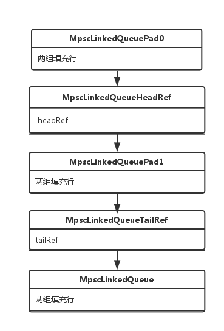
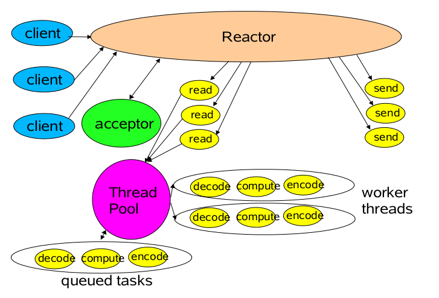

# Netty启动过程

本部分主要说明Netty启动过程中ServerBootstrap类(以及其父类AbstactBootstrap)配置方法的意义以及其源码。

## group

此方法接收一个EventLoopGroup作为参数，其源码如下所示:

```java
@Override
public ServerBootstrap group(EventLoopGroup group) {
  return group(group, group);
}

public ServerBootstrap group(EventLoopGroup parentGroup, EventLoopGroup childGroup) {
  super.group(parentGroup);
  if (childGroup == null) {
    throw new NullPointerException("childGroup");
  }
  if (this.childGroup != null) {
    throw new IllegalStateException("childGroup set already");
  }
  this.childGroup = childGroup;
  return this;
}
```

由此可见，实际上执行的是两个参数的group方法。Netty其实需要两个EventLoopGroup，一个用来接收客户端的连接，即原生nio中的selector操作，但是目前还不知道为什么此处需要多线程。另一个(childGroup)用来处理客户端连接。两个EventLoopGroup的具体分工是怎样的，有待探究。

## channel

此方法用以设置Netty使用Channel类型(NioServerSocketChannel)，此处Channel的类型也就决定了Netty使用什么样的工作方式。此方法实际上就是初始化了内部的channelFactory属性，等到调用bind()方法时，才会进一步使用此channelFactory通过反射的方式生成一个channel对象。

## option

此方法用以设置Netty服务器的配置参数，源码如下:

```java
public <T> B option(ChannelOption<T> option, T value) {
  if (option == null) {
    throw new NullPointerException("option");
  }
  if (value == null) {
    synchronized (options) {
      options.remove(option);
    }
  } else {
    synchronized (options) {
      options.put(option, value);
    }
  }
  return (B) this;
}
```

Netty的所有配置都保存在Map<ChannelOption<?>,Object> options中。注意ChannelOption.SO_BACKLOG，系统内核会为socket创建一个未完成连接队列和已完成连接队列，当客户端向socket发来syn分节时系统便会在未完成队列中创建一个新的条目，当三次握手全部完成时将此条目转移至已完成队列中。系统默认此值为5，Netty默认100.

## childHandler/handler

前者是为ServerBootstrap中的ChannelHandler类型的childHandler设值，而后者是为AbstractBootstrap的ChannelHandler类型的handler设值。注释是这样说的:childHandler is used to serve the request for the Channel's.而handler则是: handler isto use for serving the requests.可以这样理解: childHandler作用于建立连接的过程，而handler则作用于请求处理的过程。从EventLoopGroup的角度来说，childHandler作用于parentGroup，而handler作用于childHandler。这也就是为什么代码经常这么写的原因:

```java
bootstrap.group(group).channel(NioServerSocketChannel.class).localAddress(port)
	.childHandler(new ChannelInitializer<Channel>() {
		@Override
		protected void initChannel(Channel channel) throws Exception {
			channel.pipeline().addLast(new EchoServerHandler());
		}
});
```

每当一个客户端完成连接时，childHandler都会为其新建立的Channel添加一个EchoServerHandler，这样就使每一个客户端Channel都有一个自己的ChannelHandler对象，于是避开了线程安全的问题。

## bind

此方法用于服务器模式(ServerBootstrap)是绑定到特定端口上(启动服务器)，其源码如下:

```java
public ChannelFuture bind() {
  validate();
  SocketAddress localAddress = this.localAddress;
  if (localAddress == null) {
    throw new IllegalStateException("localAddress not set");
  }
  return doBind(localAddress);
}
```

### validate

用于检查前面提到的group和channelFactory是否已经被设置。

### doBind

```java
private ChannelFuture doBind(final SocketAddress localAddress) {
  final ChannelFuture regFuture = initAndRegister();
  final Channel channel = regFuture.channel();
  if (regFuture.cause() != null) {
    return regFuture;
  }

  if (regFuture.isDone()) {
    ChannelPromise promise = channel.newPromise();
    doBind0(regFuture, channel, localAddress, promise);
    return promise;
  } else {
    final PendingRegistrationPromise promise = new PendingRegistrationPromise(channel);
    regFuture.addListener(new ChannelFutureListener() {
      @Override
      public void operationComplete(ChannelFuture future) throws Exception {
        Throwable cause = future.cause();
        if (cause != null) {
          promise.setFailure(cause);
        } else {
          promise.executor = channel.eventLoop();
        }
        doBind0(regFuture, channel, localAddress, promise);
      }
    });
    return promise;
  }
}
```

####  initAndRegister

可以看到首先initAndRegister被调用，此方法用于初始化Channel对象，并将其注册到parentGroup上，源码:

```java
final ChannelFuture initAndRegister() {
  final Channel channel = channelFactory().newChannel();
  try {
    init(channel);
  } catch (Throwable t) {
    channel.unsafe().closeForcibly();
    return new DefaultChannelPromise(channel,GlobalEventExecutor.INSTANCE).setFailure(t);
  }

  ChannelFuture regFuture = group().register(channel);
  if (regFuture.cause() != null) {
    if (channel.isRegistered()) {
      channel.close();
    } else {
      channel.unsafe().closeForcibly();
    }
  }
  return regFuture;
}
```

可以看到，正是利用了channelFactory来new Channel对象。

##### init

Init()方法是一个模板方法，真正的实现在ServerBootstrap，如下:

```java
@Override
void init(Channel channel) throws Exception {
  final Map<ChannelOption<?>, Object> options = options();
  //将为Boostrap设置的参数转发到Channel中
  synchronized (options) {
    channel.config().setOptions(options);
  }

  //把为Boostrap设置的属性转发到Channel中(Channel继承自AttributeMap接口)，目前不知道这个属性是做什么的 
  final Map<AttributeKey<?>, Object> attrs = attrs();
  synchronized (attrs) {
    for (Entry<AttributeKey<?>, Object> e: attrs.entrySet()) {
      @SuppressWarnings("unchecked")
      AttributeKey<Object> key = (AttributeKey<Object>) e.getKey();
      channel.attr(key).set(e.getValue());
    }
  }

  //添加连接建立时的handler
  ChannelPipeline p = channel.pipeline();
  if (handler() != null) {
    p.addLast(handler());
  }

  final EventLoopGroup currentChildGroup = childGroup;
  final ChannelHandler currentChildHandler = childHandler;
  final Entry<ChannelOption<?>, Object>[] currentChildOptions;
  final Entry<AttributeKey<?>, Object>[] currentChildAttrs;
  //整理childOptions
  synchronized (childOptions) {
    currentChildOptions = childOptions.entrySet().toArray(newOptionArray(childOptions.size()));
  }
  //整理childAttrs
  synchronized (childAttrs) {
    currentChildAttrs = childAttrs.entrySet().toArray(newAttrArray(childAttrs.size()));
  }
  
  p.addLast(new ChannelInitializer<Channel>() {
    @Override
    public void initChannel(Channel ch) throws Exception {
      ch.pipeline().addLast(new ServerBootstrapAcceptor(
        currentChildGroup, currentChildHandler, currentChildOptions, currentChildAttrs));
    }
  });
}
```

经过此方法之后，父Channel上的ChannelHandler分布图:


从ChannelInitializer的源码中可以看出，**其对象被调用一次后，将从pipleline上移除**。所以当父Channel初始化完成时，父Channel上的ChannelHandler就变成了下面这样:


###### ServerBootstrapAcceptor

ServerBootstrapAcceptor是ServerBootstrap的内部类，其channelRead方法如下:

```java
@Override
@SuppressWarnings("unchecked")
public void channelRead(ChannelHandlerContext ctx, Object msg) {
  final Channel child = (Channel) msg;

  child.pipeline().addLast(childHandler);

  for (Entry<ChannelOption<?>, Object> e: childOptions) {
    try {
      if (!child.config().setOption((ChannelOption<Object>) e.getKey(), e.getValue())) {
        logger.warn("Unknown channel option: " + e);
      }
    } catch (Throwable t) {
      logger.warn("Failed to set a channel option: " + child, t);
    }
  }

  for (Entry<AttributeKey<?>, Object> e: childAttrs) {
    child.attr((AttributeKey<Object>) e.getKey()).set(e.getValue());
  }

  try {
    childGroup.register(child).addListener(new ChannelFutureListener() {
      @Override
      public void operationComplete(ChannelFuture future) throws Exception {
        if (!future.isSuccess()) {
          forceClose(child, future.cause());
        }
      }
    });
  } catch (Throwable t) {
    forceClose(child, t);
  }
}
```

可以看出，**ServerBootstrapAcceptor负责配置child channel的option, attr, channelHandler以及将child channel注册到childGroup上**。

所以可以推断，child channel上的ChannelHandler一定是这样:


注意，此ChannelInitializer就是通过Boostrap.childHandler()设置的。结合之前ServerBootstrapAcceptor的源码，可以发现: **每一个child channel上的ChannelInitilizer(通过Boostrap.childHandler()设置)都是同一个对象**。

当child channel初始化完成之后，就变成了这样:


##### EventLoop.register

向parentGroup注册其实就是从其中选取一个线程(EventLoop)并将channel注册到此线程上。Register方法的真正实现在抽象类MultithreadEventLoopGroup，源码:

```java
@Override
public ChannelFuture register(Channel channel) {
	return next().register(channel);
}
```

###### EventLoop选取策略

Next方法用于从线程池(EventLoopGroup)中选取线程(EventLoop)，此方法的真正实现在MultithreadEventExecutorGroup中，源码如下:

```java
 @Override
 public EventExecutor next() {
 	return chooser.next();
 }
```

chooser是一个EventExecutorChooser(接口)的对象，EventExecutorChooser是一个定义在MultithreadEventExecutorGroup中的private接口，正是策略模式的体现。

此接口共有两个实现类，分别是PowerOfTwoEventExecutorChooser和GenericEventExecutorChooser。如果设置的线程数是2的幂，那么将使用位操作(index & 个数减一)，否则使用取余的方式。

线程数的设置直接利用带参数的EventLoopGroup构造函数即可，如果使用了无参构造器(或0)将使用默认值，即处理器核心数的2倍。

###### EventLoop初始化(newChild)

可以看到next方法返回的是EventExecutor接口类型，而此接口是EventLoop的父接口。真正的类型取决于MultithreadEventExecutorGroup的构造器。部分源码如下:

```java
 for (int i = 0; i < nEventExecutors; i ++) {
   boolean success = false;
   try {
     children[i] = newChild(executor, args);
  //...
```

正是由newChild方法完成了EventLoop的初始化，此方法是一个模板方法，真正的实现在其子类NioEventLoopGroup中，源码:

```java
@Override
protected EventLoop newChild(Executor executor, Object... args) throws Exception {
	return new NioEventLoop(this, executor, (SelectorProvider) args[0]);
}
```

NioEventLoop的构造器参数executor用以真正调用EventLoop的run方法，从源码中可以很容易看出**一个EventLoopGroup中的所有EventLoop公用一个executor**，如果使用默认构造器(NioEventLoopGroup)，那么将使用默认的线程池，MultithreadEventExecutorGroup构造器部分源码:

```java
if (executor == null) {
	executor = newDefaultExecutorService(nEventExecutors);
    shutdownExecutor = true;
}
```

可以看出，线程池线程的个数就是默认EventLoop的个数。但是这也提供了一个可能: **一个EventLoopGroup中所有的EventLoop公用一个线程**。

newDefaultExecutorService方法源码:

```java
protected ExecutorService newDefaultExecutorService(int nEventExecutors) {
	return new DefaultExecutorServiceFactory(getClass()).newExecutorService(nEventExecutors);
}
```

newExecutorService源码:

```java
@Override
public ExecutorService newExecutorService(int parallelism) {
  ForkJoinWorkerThreadFactory threadFactory =
    new DefaultForkJoinWorkerThreadFactory(namePrefix + '-' +        executorId.getAndIncrement());

  return new ForkJoinPool(parallelism,    threadFactory,DefaultUncaughtExceptionHandler.INSTANCE, true);
}
```

Netty默认使用ForkJoinPool，虽然此类的包名是io.netty.util.internal.chmv8，但是jdk1.7已经带了此类，netty应该是考虑到兼容性才这么做。关于fork/join的好处以及讨论可以参考: [Java 7 Fork/Join 并行计算框架概览](images/http://www.iteye.com/topic/643724), [ForkJoinPool-based EventLoopGroup #2250](images/https://github.com/netty/netty/issues/2250)。

再说newChild方法的SelectorProvider参数，此参数在默认情况下就是使用的jdk的java.nio.channels.spi.SelectorProvider。提供此参数的目的在于可以让用户选择自己实现的SelectorProvider(好高端...)。

###### register

next()方法说完了就是EventLoop的register()了，此方法的实现在SingleThreadEventLoop，源码:

```java
@Override
public ChannelFuture register(Channel channel) {
	return register(channel, new DefaultChannelPromise(channel, this));
}
```

继续:

```java
@Override
public ChannelFuture register(final Channel channel, final ChannelPromise promise) {
	if (channel == null) {
		throw new NullPointerException("channel");
	}
    if (promise == null) {
        throw new NullPointerException("promise");
     }

     channel.unsafe().register(this, promise);
     return promise;
}
```

unsafe是在Channel内部定义的一个内部接口，里面包含了一些只应该在内部使用的方法。此register方法位于Channel接口的骨架实现类AbstractChannel，源码:

```java
@Override
public final void register(EventLoop eventLoop, final ChannelPromise promise) {
  if (eventLoop == null) {
    throw new NullPointerException("eventLoop");
  }
  if (promise == null) {
    throw new NullPointerException("promise");
  }
  if (isRegistered()) {
    promise.setFailure(new IllegalStateException("registered to an event loop already"));
    return;
  }
  //模板方法
  if (!isCompatible(eventLoop)) {
    promise.setFailure(
      new IllegalStateException("incompatible event loop type: " + eventLoop.getClass().getName()));
    return;
  }

  // It's necessary to reuse the wrapped eventloop object. Otherwise the user will end up with multiple
  // objects that do not share a common state.
  //直接把EventLoop赋给局部变量保存起来
  if (AbstractChannel.this.eventLoop == null) {
    AbstractChannel.this.eventLoop = new PausableChannelEventLoop(eventLoop);
  } else {
    AbstractChannel.this.eventLoop.unwrapped = eventLoop;
  }
  //判断给定的eventLoop是不是Thread.currentThread
  if (eventLoop.inEventLoop()) {
    register0(promise);
  } else {
    try {
      eventLoop.execute(new OneTimeTask() {
        @Override
        public void run() {
          register0(promise);
        }
      });
    } catch (Throwable t) {
      logger.warn(
        "Force-closing a channel whose registration task was not accepted by an event loop: {}",
        AbstractChannel.this, t);
      closeForcibly();
      closeFuture.setClosed();
      safeSetFailure(promise, t);
    }
  }
}
```

isCompatible方法用于检测给定的EventLoop是否适用于此channel，对于NioServerSocketChannel来说，其真正实现在其父类AbstractNioChannel，源码:

```java
@Override
protected boolean isCompatible(EventLoop loop) {
	return loop instanceof NioEventLoop;
}
```

###### register0

register0源码:

```java
private void register0(ChannelPromise promise) {
  try {
    // check if the channel is still open as it could be closed in the mean time when the register
    // call was outside of the eventLoop
    if (!promise.setUncancellable() || !ensureOpen(promise)) {
      return;
    }
    boolean firstRegistration = neverRegistered;
    doRegister();
    neverRegistered = false;
    registered = true;
    //将开始接收任务标志位设为true，表示可以接收任务
    eventLoop.acceptNewTasks();
    safeSetSuccess(promise);
    //触发channelRegistered事件，并调用相关Handler的回调函数
    pipeline.fireChannelRegistered();
    // Only fire a channelActive if the channel has never been registered. This prevents firing
    // multiple channel actives if the channel is deregistered and re-registered.
    if (firstRegistration && isActive()) {
      //触发channelActive事件，但是触发的是哪个pipleline? 如果是建立连接的，那么childHandler方法添加的handler是何时被加入到此pipleLine中的?
      pipeline.fireChannelActive();
    }
  } catch (Throwable t) {
    // Close the channel directly to avoid FD leak.
    closeForcibly();
    closeFuture.setClosed();
    safeSetFailure(promise, t);
  }
}
```

ChannelRegistered事件从head开始按照inBound的顺序触发，ChannelAdapter里面默认实现为向后转发，tail里面空实现。特别注意ChannelInitializer的实现:

```java
@Override
public final void channelRegistered(ChannelHandlerContext ctx) throws Exception {
	ChannelPipeline pipeline = ctx.pipeline();
    boolean success = false;
    try {
      	//调用回调函数
		initChannel((C) ctx.channel());
      	//移除自身
        pipeline.remove(this);
      	//继续转发
        ctx.fireChannelRegistered();
        success = true;
    } catch (Throwable t) {
		logger.warn("Failed to initialize a channel. Closing: " + ctx.channel(), t);
	} finally {
		if (pipeline.context(this) != null) {
			pipeline.remove(this);
        }
        if (!success) {
        	ctx.close();
        }
	}
}
```

在这里可以得出一个结论: **只有显示地调用ctx.fireXXX()时pipleline才会继续执行**。

isActive源码:

```java
@Override
public boolean isActive() {
	return javaChannel().socket().isBound();
}
```

channelActive事件同样是inBound执行，tail同样是空实现。

###### doRegister

doRegister默认是一个空实现，NioServerSocketChannel的父类AbstractNioChannel重写了此方法。

```java
@Override
protected void doRegister() throws Exception {
  boolean selected = false;
  for (;;) {
    try {
      selectionKey = javaChannel().register(((NioEventLoop) eventLoop().unwrap()).selector, 0, this);
      return;
    } catch (CancelledKeyException e) {
      if (!selected) {
        // Force the Selector to select now as the "canceled" SelectionKey may still be
        // cached and not removed because no Select.select(..) operation was called yet.
        ((NioEventLoop) eventLoop().unwrap()).selectNow();
        selected = true;
      } else {
        // We forced a select operation on the selector before but the SelectionKey is still cached
        // for whatever reason. JDK bug ?
        throw e;
      }
    }
  }
}
```

javaChannel方法获取的就是jdk里的channel，对于NioServerSocketChannel来说就是ServerSocketChannel。此字段在initAndRegister方法中初始化Channel时被设置，NioServerSocketChannel无参构造器源码:

```java
public NioServerSocketChannel() {
	this(newSocket(DEFAULT_SELECTOR_PROVIDER));
}
```

newSocket:

```java
private static ServerSocketChannel newSocket(SelectorProvider provider) {
  try {
    return provider.openServerSocketChannel();
  } catch (IOException e) {
    throw new ChannelException(
      "Failed to open a server socket.", e);
  }
}
```

DEFAULT_SELECTOR_PROVIDER就是jdk SelectorProvider.provider()，此方法返回系默认的provider，对于windows系统就是sun.nio.ch.WindowsSelectorProvider。查看jdk源码可以发现，其实ServerSocketChannel.open()也是通过newSocket这样的方式初始化一个ServerSocketChannel。

显而易见，**Netty使用了组合模式，io.netty.channel.Channel中的 很多方法其实就是直接调用java.nio.channels.Channel的相应方法实现。**

javaChannel().register方法就是jdk的原生实现。其参数selector在EventLoop初始化时由传入的SelectorProvider.openSelector()完成初始化。

回到register0方法，pipleline是在Channel的构造器里完成初始化的，由此可见: **每一个Channel都有一个独立的PipleLine**。

####  doBind0

最后再回到ServerBoostrap.bind方法里的doBind0：

```java
 private static void doBind0(
   final ChannelFuture regFuture, final Channel channel,
   final SocketAddress localAddress, final ChannelPromise promise) {

   // This method is invoked before channelRegistered() is triggered.  Give user handlers a chance to set up
   // the pipeline in its channelRegistered() implementation.
   channel.eventLoop().execute(new Runnable() {
     @Override
     public void run() {
       if (regFuture.isSuccess()) {
         channel.bind(localAddress, promise).addListener(ChannelFutureListener.CLOSE_ON_FAILURE);
       } else {
         promise.setFailure(regFuture.cause());
       }
     }
   });
 }
```

channel.bind的实现位于AbstractChannel，源码:

```java
@Override
public ChannelFuture bind(SocketAddress localAddress, ChannelPromise promise) {
	return pipeline.bind(localAddress, promise);
}
```

DefaultChannelPipeline:

```java
@Override
public ChannelFuture bind(SocketAddress localAddress, ChannelPromise promise) {
	return tail.bind(localAddress, promise);
}
```

pipleline中的head和tail其实是AbstractChannelHandlerContext类型:

```java
@Override
public ChannelFuture bind(final SocketAddress localAddress, final ChannelPromise promise) {
	AbstractChannelHandlerContext next = findContextOutbound();
    next.invoker().invokeBind(next, localAddress, promise);
    return promise;
}
```

不只是head和tail，**每个添加到pipleline的ChannelHandler都会被包装成ChannelHandlerContext类型，这样做的意义在于ChannelHandler和与其相关的pipleline, invoker, name, skipFlags封装在一起**。

findContextOutbound的实现原理在下面的章节会专门提到。invoker:

```java
@Override
public final ChannelHandlerInvoker invoker() {
	if (invoker == null) {
		return channel().eventLoop().asInvoker();
	} else {
		return wrappedEventLoop();
	}
}
```

对于直接执行pipleline.addLast(handler)添加进来的handler，其invoker并没有指定，将使用默认实现。

asInvoker实现位于SingleThreadEventLoop:

```java
private final ChannelHandlerInvoker invoker = new DefaultChannelHandlerInvoker(this);
@Override
public ChannelHandlerInvoker asInvoker() {
	return invoker;
}
```

DefaultChannelHandlerInvoker的构造器就是把EventLoop保存在成员变量executor中。如果你指定了invoker，那么就会执行wrappedEventLoop:

```java
private PausableChannelEventExecutor wrappedEventLoop() {
	PausableChannelEventExecutor wrapped = wrappedEventLoop;
	if (wrapped == null) {
		wrapped = new PausableChannelEventExecutor0();
        if (!WRAPPED_EVENTEXECUTOR_UPDATER.compareAndSet(this, null, wrapped)) {
        	// Set in the meantime so we need to issue another volatile read
            return wrappedEventLoop;
        }
    }
    return wrapped;
}
```

因为wrapper必定为空，所以实际上返回了一个PausableChannelEventExecutor0对象。

回到invokeBind，可以发现之后调用了ChannelHandlerInvokerUtil的invokeBindNow:

```java
public static void invokeBindNow(
  final ChannelHandlerContext ctx, final SocketAddress localAddress, final ChannelPromise promise) {
  try {
    ctx.handler().bind(ctx, localAddress, promise);
  } catch (Throwable t) {
    notifyOutboundHandlerException(t, promise);
  }
}
```

直接调用了ChannelHandler的bind()，此方法的注释: **Called once a bind operation is made.可以理解为实际上此方法依然和事件监听类似，只是监听了一下bind事件**。此方法在ChannelHandlerAdapter实现:

```java
@Skip
@Override
public void bind(ChannelHandlerContext ctx, SocketAddress localAddress, ChannelPromise promise) throws Exception {
	ctx.bind(localAddress, promise);
}
```

**@Skip注释表明此方法什么都不做，只是转发到下一个ChannelHandler**。其实除了此方法，**ChannelHandlerAdapter中的全部方法(handlerAdded, handlerRemoved除外)都是此种实现**。

bind事件是从tail向head倒着触发的，head是一个HeadContext类型(DefaultChannelPipleline内部 类)，其bind()源码:

```java
@Override
public void bind(
	ChannelHandlerContext ctx, SocketAddress localAddress, ChannelPromise promise)
	throws Exception {
	unsafe.bind(localAddress, promise);
}
```

unsafe的bind方法真正执行绑定到端口(IP)，终于找到了。

## 保持运行

直接上代码:

```java
ChannelFuture cf = b.bind(8080).sync(); 
cf.channel().closeFuture().sync();
```

closeFuture的实现在AbstractChannel:

```java
private final CloseFuture closeFuture = new CloseFuture(this);
@Override
public ChannelFuture closeFuture() {
	return closeFuture;
}
```

CloseFuture是AbstractChannel的内部类。

## EventLoop初始化(以NioEventLoop为例)

前面的bind中没有说明初始化的细节，在此补充。

NioEventLoop构造器:

```java
NioEventLoop(NioEventLoopGroup parent, Executor executor, SelectorProvider selectorProvider) {
	super(parent, executor, false);
    if (selectorProvider == null) {
		throw new NullPointerException("selectorProvider");
	}
	provider = selectorProvider;
    selector = openSelector();
}
```

### Selector优化

**每一个EventLoop都有自己的selector，bossGroup中用于接收连接，workerGroup中用于处理IO操作**。openSelector正是完成其初始化的操作:

```java
private Selector openSelector() {
  final Selector selector;
  try {
    selector = provider.openSelector();
  } catch (IOException e) {
    throw new ChannelException("failed to open a new selector", e);
  }
  //如果禁用了Netty优化
  if (DISABLE_KEYSET_OPTIMIZATION) {
    return selector;
  }

  try {
    SelectedSelectionKeySet selectedKeySet = new SelectedSelectionKeySet();

    Class<?> selectorImplClass =
      Class.forName("sun.nio.ch.SelectorImpl", false, PlatformDependent.getSystemClassLoader());

    // Ensure the current selector implementation is what we can instrument.
    if (!selectorImplClass.isAssignableFrom(selector.getClass())) {
      return selector;
    }

    Field selectedKeysField = selectorImplClass.getDeclaredField("selectedKeys");
    Field publicSelectedKeysField = selectorImplClass.getDeclaredField("publicSelectedKeys");

    selectedKeysField.setAccessible(true);
    publicSelectedKeysField.setAccessible(true);

    selectedKeysField.set(selector, selectedKeySet);
    publicSelectedKeysField.set(selector, selectedKeySet);

    selectedKeys = selectedKeySet;
    logger.trace("Instrumented an optimized java.util.Set into: {}", selector);
  } catch (Throwable t) {
    selectedKeys = null;
    logger.trace("Failed to instrument an optimized java.util.Set into: {}", selector, t);
  }

  return selector;
}
```

优化的原理:

sun.nio.ch.SelectorImpl中selectedKeys和publicSelectedKeys两个字段是HashSet类型，select()操作很大程度上是对这两个Set的遍历，HashSet采用的是数组 + 链表的结构遍历速度并不快，并且需要自动扩容，而且Set不利于发挥cpu cache lin的性能。Netty使用一个SelectedSelectionKeySet类型代替了上面提到的两个字段，此类型使用1024大小的数组实现，可以去看源码。

### TaskQueue(MPSC)

SingleThreadEventExecutor构造器源码:

```java
protected SingleThreadEventExecutor(EventExecutorGroup parent, Executor executor, boolean addTaskWakesUp) {
	super(parent);
	if (executor == null) {
		throw new NullPointerException("executor");
	}
	this.addTaskWakesUp = addTaskWakesUp;
    this.executor = executor;
  	//初始化TaskQueue
    taskQueue = newTaskQueue();
}
```

SingleThreadEventExecutor的newTaskQueue使用LinkedBlockingQueue<Runnable>实现，但是NioEventLoop重写了此方法:

```java
@Override
protected Queue<Runnable> newTaskQueue() {
	// This event loop never calls takeTask()
 	return PlatformDependent.newMpscQueue();
}
```

MPSC即Multi Productor Single Consumer，此种队列是为了在这种特殊场景下专优化的**无锁队列**。Netty的即io.netty.util.internal.MpscLinkedQueue，参考了[JCTools](images/https://github.com/JCTools/JCTools)的实现。

下面是 结合源码说明这种队列到底特殊在哪里:

#### 伪共享

CPU一般有L1, L2, L3三级缓存，其中L3是被各个核心所共享的。而L3缓存以缓存行为单位(一般为64B)，CPU会一次性加载一个缓存行的内容，当几个线程需要独立的修改一个缓存行里面的几个变量时，就会在缓存行上产生竞争的情况: 一个线程/核心获得缓存行后，其它核心的L1/L2缓存就会失效。这就会导致隐性的竞争情况。MpscLinkedQueue继承体系如下图:



可以看出，整个队列中最重要/常用的两个字段(headRef, tailRef)都被分隔到了独立的缓存行中，从而避免了和其它变量之间产生伪共享问题。

参考: [伪共享(False Sharing)](http://ifeve.com/falsesharing/)

#### CAS

对于MPSC来说，多个生产者竞争将新的元素添加到队列的尾部，为此队列采用CAS的方式原子更新队列:

```java
@SuppressWarnings("unchecked")
protected final MpscLinkedQueueNode<E> getAndSetTailRef(MpscLinkedQueueNode<E> tailRef) {
	// LOCK XCHG in JDK8, a CAS loop in JDK 7/6
	return (MpscLinkedQueueNode<E>) UPDATER.getAndSet(this, tailRef);
}
```

UPDATER是AtomicReferenceFieldUpdater。

#### lazySet

由于只有一个消费者，不需要保证headRef的内存可见性，所以使用了AtomicXXX的lazySet:

```java
protected final void lazySetHeadRef(MpscLinkedQueueNode<E> headRef) {
	UPDATER.lazySet(this, headRef);
}
```

参考: [聊聊高并发（十八）理解AtomicXXX.lazySet方法](images/http://blog.csdn.net/iter_zc/article/details/40744485)

### scheduledTaskQueue

EventLoop中其实还有一个队列，此队列在用的时候才会初始化:

```java
Queue<ScheduledFutureTask<?>> scheduledTaskQueue() {
	if (scheduledTaskQueue == null) {
		scheduledTaskQueue = new PriorityQueue<ScheduledFutureTask<?>>();
	}
	return scheduledTaskQueue;
}
```


## EventLoop运行

EventLoop的开始运行可以从两个角度理解: 1. run方法的执行。2. 为Selector设置interestOps。

### run

run方法的执行应该起始于EventLoop的execute方法(SingleThreadEventExecutor实现):

```java

```

startExecution:

```java
private void startExecution() {
	if (STATE_UPDATER.get(this) == ST_NOT_STARTED) {
		if (STATE_UPDATER.compareAndSet(this, ST_NOT_STARTED, ST_STARTED)) {
          	//1
			schedule(new ScheduledFutureTask<Void>(
                        this, Executors.<Void>callable(new PurgeTask(), null),
                        ScheduledFutureTask.deadlineNanos(SCHEDULE_PURGE_INTERVAL), -SCHEDULE_PURGE_INTERVAL));
          	 //2
             scheduleExecution();
            }
        }
    }
```

共进行了两步操作: 首先开启一个周期任务(PurgeTask)，用于定期检查scheduledTaskQueue中是否有已经被取消的任务，如果有，那么将其从队列移除。

scheduleExecution:

```java
protected final void scheduleExecution() {
  	//TODO 为毛要把THREAD_UPDATER设为null?
	updateThread(null);
	executor.execute(asRunnable);
}
```

asRunnable:

```java
private final Runnable asRunnable = new Runnable() {
  @Override
  public void run() {
    updateThread(Thread.currentThread());

    // lastExecutionTime must be set on the first run
    // in order for shutdown to work correctly for the
    // rare case that the eventloop did not execute
    // a single task during its lifetime.
    if (firstRun) {
      firstRun = false;
      updateLastExecutionTime();
    }

    try {
      //最终调用run方法
      SingleThreadEventExecutor.this.run();
    } catch (Throwable t) {
      logger.warn("Unexpected exception from an event executor: ", t);
      cleanupAndTerminate(false);
    }
  }
};
```

###  设置interestOps

入口函数在DefaultChannelPipleline:

```java
@Override
public ChannelPipeline fireChannelActive() {
	head.fireChannelActive();
  	//默认为true
	if (channel.config().isAutoRead()) {
		channel.read();
	}
	return this;
}
```

关于此方法的触发时机: 在初始化的过程中共有两处尝试触发channelActive事件。

- AbstractChannel.register0: 在channelRegister触发之后，会进行一次channelActive触发尝试。但是由于bind操作是由EventLoop完成的，所以此时可能尚未绑定成功，所以channelActive很可能在此处无法触发。

- AbstractUnsafe.bind: 其部分代码如下:

  ```java
  //...
  if (!wasActive && isActive()) {
  	invokeLater(new OneTimeTask() {
      	@Override
      	public void run() {
      		pipeline.fireChannelActive();
      	}
      });
  }
  ```

  一般来说在这里触发。

channel.read直接调用pipleline.read。read事件从tail开始倒序传递。真正的处理在head节点，调用了unsafe.beginRead, beginRead方法中调用了模板方法doBeginRead，真正实现：

Abstract.doBeginRead:

```java
@Override
protected void doBeginRead() throws Exception {
	// Channel.read() or ChannelHandlerContext.read() was called
    if (inputShutdown) {
    	return;
	}

    final SelectionKey selectionKey = this.selectionKey;
    if (!selectionKey.isValid()) {
    	return;
    }

    readPending = true;

    final int interestOps = selectionKey.interestOps();
    if ((interestOps & readInterestOp) == 0) {
    	selectionKey.interestOps(interestOps | readInterestOp);
	}
}
```

成员变量readInterestOp便是此Channel感兴趣的标志位，它由子类构造器传递而来，以NioServerSocketChannel为例:

```java
public NioServerSocketChannel(ServerSocketChannel channel) {
	super(null, channel, SelectionKey.OP_ACCEPT);
    config = new NioServerSocketChannelConfig(this, javaChannel().socket());
}
```

看到了喜闻乐见的SelectionKey.OP_ACCEPT.

# Netty服务器运行

还是以NioEventLoop为例，run:

```java
@Override
protected void run() {
	boolean oldWakenUp = wakenUp.getAndSet(false);
    try {
      	//有没有非IO任务在等待
    	if (hasTasks()) {
          	//执行一次非阻塞select
        	selectNow();
		} else {
          	//执行阻塞的select
        	select(oldWakenUp);
            if (wakenUp.get()) {
            	selector.wakeup();
			}
        }

        cancelledKeys = 0;
      	//ioRatio控制IO操作/非IO操作的比例
        needsToSelectAgain = false;
        final int ioRatio = this.ioRatio;
        if (ioRatio == 100) {
        	processSelectedKeys();
            runAllTasks();
		} else {
        	final long ioStartTime = System.nanoTime();
			//处理IO操作
            processSelectedKeys();
            final long ioTime = System.nanoTime() - ioStartTime;
          	//处理非IO操作
            runAllTasks(ioTime * (100 - ioRatio) / ioRatio);
		}

        if (isShuttingDown()) {
        	closeAll();
			if (confirmShutdown()) {
            	cleanupAndTerminate(true);
                return;
            }
		}
	} catch (Throwable t) {
		//忽略...
        try {
        	Thread.sleep(1000);
        } catch (InterruptedException e) {
			// Ignore.
		}
	}
	scheduleExecution();
}
```

关于run方法更为详细的分析参见: [Netty源码细节1--IO线程(EventLoop)](http://budairenqin.iteye.com/blog/2215896)

## IO操作处理

NioEventLoop.processSelectedKeys:

```java
private void processSelectedKeys() {
	if (selectedKeys != null) {
      	//使用优化
    	processSelectedKeysOptimized(selectedKeys.flip());
	} else {
      	//不使用优化
    	processSelectedKeysPlain(selector.selectedKeys());
	}
}
```

NioEventLoop.processSelectedKeysPlain:

```java
private void processSelectedKeysPlain(Set<SelectionKey> selectedKeys) {
  	//...
	Iterator<SelectionKey> i = selectedKeys.iterator();
    for (;;) {
    	final SelectionKey k = i.next();
        final Object a = k.attachment();
        i.remove();

        if (a instanceof AbstractNioChannel) {
        	processSelectedKey(k, (AbstractNioChannel) a);
        } else {
          	//Netty并没有实现NioTask接口，所以一般来说不会执行到这个分支
        	@SuppressWarnings("unchecked")
            NioTask<SelectableChannel> task = (NioTask<SelectableChannel>) a;
            processSelectedKey(k, task);
		}

        if (!i.hasNext()) {
        	break;
		}

      	//执行了cancel操作此处为true
        if (needsToSelectAgain) {
        	selectAgain();
            selectedKeys = selector.selectedKeys();

            // Create the iterator again to avoid ConcurrentModificationException
            if (selectedKeys.isEmpty()) {
            	break;
			} else {
            	i = selectedKeys.iterator();
			}
		}
    }
}
```

NioEventLoop.processSelectedKey:

```java
private static void processSelectedKey(SelectionKey k, AbstractNioChannel ch) {
	final AbstractNioChannel.NioUnsafe unsafe = ch.unsafe();
    if (!k.isValid()) {
    	// close the channel if the key is not valid anymore
        unsafe.close(unsafe.voidPromise());
        return;
	}
    try {
    	int readyOps = k.readyOps();
		if ((readyOps & (SelectionKey.OP_READ | SelectionKey.OP_ACCEPT)) != 0 || readyOps == 0) {
          	//读事件/accept事件
			unsafe.read();
            if (!ch.isOpen()) {
            	// Connection already closed - no need to handle write.
                return;
			}
		}
      	//写事件
        if ((readyOps & SelectionKey.OP_WRITE) != 0) {
			ch.unsafe().forceFlush();
		}
      	//连接事件
        if ((readyOps & SelectionKey.OP_CONNECT) != 0) {
        	int ops = k.interestOps();
          	//需要手动清除连接标志位，否则select方法一直都会返回这个状态
          	//但是这就产生了一个新的问题: NioServerSocketChannel仍然需要等待连接?
            ops &= ~SelectionKey.OP_CONNECT;
            k.interestOps(ops);
			unsafe.finishConnect();
		}
	} catch (CancelledKeyException ignored) {
    	unsafe.close(unsafe.voidPromise());
	}
}
```

### Accept

从源码可以看出，对于accept的处理被整合到了unsafe.read.

AbstractNioMessageChannel.NioMessageUnsafe.read:

```java
@Override
public void read() {
	assert eventLoop().inEventLoop();
    final ChannelConfig config = config();
    if (!config.isAutoRead() && !isReadPending()) {
    	// ChannelConfig.setAutoRead(false) was called in the meantime
        removeReadOp();
        return;
    }

    final int maxMessagesPerRead = config.getMaxMessagesPerRead();
    final ChannelPipeline pipeline = pipeline();
    boolean closed = false;
    Throwable exception = null;
    try {
    	try {
        	for (;;) {
              	//关键就在这里
            	int localRead = doReadMessages(readBuf);
                if (localRead == 0) {
                	break;
                }
                if (localRead < 0) {
                	closed = true;
                    break;
                }

                // stop reading and remove op
                if (!config.isAutoRead()) {
                	break;
                }
				//读取的消息数目是否超过最大限制
                if (readBuf.size() >= maxMessagesPerRead) {
                	break;
                }
			}
        } catch (Throwable t) {
        	exception = t;
        }
        setReadPending(false);
        int size = readBuf.size();
        for (int i = 0; i < size; i ++) {
          	//触发channelRead
        	pipeline.fireChannelRead(readBuf.get(i));
        }

        readBuf.clear();
      	//触发channelReadComplete
        pipeline.fireChannelReadComplete();

        if (exception != null) {
        	if (exception instanceof IOException && !(exception instanceof PortUnreachableException)) {
				closed = !(AbstractNioMessageChannel.this instanceof ServerChannel);
             }
             pipeline.fireExceptionCaught(exception);
        }

		if (closed) {
			if (isOpen()) {
            	close(voidPromise());
            }
        }
	} finally {
		if (!config.isAutoRead() && !isReadPending()) {
        	removeReadOp();
        }
    }
}
```

NioServerSocketChannel.doReadMessage:

```java
@Override
protected int doReadMessages(List<Object> buf) throws Exception {
	SocketChannel ch = javaChannel().accept();
    try {
    	if (ch != null) {
          	//包装为NioSocketChannel,在本类以及父类的构造函数中完成SelectionKey.OP_READ，
          	//NioSocketChannelConfig的初始化
        	buf.add(new NioSocketChannel(this, ch));
            return 1;
		}
	} catch (Throwable t) {
    	logger.warn("Failed to create a new channel from an accepted socket.", t);
		try {
        	ch.close();
		} catch (Throwable t2) {
			logger.warn("Failed to close a socket.", t2);
		}
	}
	return 0;
}
```

channelRead方法为inBound事件，从head开始触发。

HeadContext.fireChannelRead:

```java
@Override
public ChannelHandlerContext fireChannelRead(Object msg) {
	AbstractChannelHandlerContext next = findContextInbound();
  	//引用计数? 只有msg实现了ReferenceCounted接口才起作用，NioSocketChannel并没有实现
  	//ByteBuf全家都实现了，所以此方法只在read/write这种IO事件才有用
    ReferenceCountUtil.touch(msg, next);
    invokedNextChannelRead = true;
    next.invoker().invokeChannelRead(next, msg);
    return this;
}
```

参考前面init部分，bossGroup中的channel上其实只有一个handler(如果没有调用Bootstrap.handler)，即ServerBootstrapAcceptor。

之后触发了channelReadCompelte事件，ServerBootstrapAcceptor和Tail都是空实现，没啥好说的。

### read

以NioSocketChannel为例。

NioByteUnsafe.read:

```java
@Override
public final void read() {
	final ChannelConfig config = config();
	if (!config.isAutoRead() && !isReadPending()) {
    	// ChannelConfig.setAutoRead(false) was called in the meantime
    	removeReadOp();
    	return;
  	}

	final ChannelPipeline pipeline = pipeline();
  	//默认取ByteBufUtil.DEFAULT_ALLOCATOR
  	final ByteBufAllocator allocator = config.getAllocator();
  	//ServerChannel和AbstractNioByteChannel默认取16，其它1
  	final int maxMessagesPerRead = config.getMaxMessagesPerRead();
  	//用以分配一个大小合适的缓冲区
  	RecvByteBufAllocator.Handle allocHandle = recvBufAllocHandle();

  	ByteBuf byteBuf = null;
  	int messages = 0;
  	boolean close = false;
  	try {
    	int totalReadAmount = 0;
    	boolean readPendingReset = false;
    	do {
      		byteBuf = allocHandle.allocate(allocator);
          	//缓冲区可写的字节数
      		int writable = byteBuf.writableBytes();
          	//真正执行读操作
      		int localReadAmount = doReadBytes(byteBuf);
      		if (localReadAmount <= 0) {
        		// not was read release the buffer
        		byteBuf.release();
        		byteBuf = null;
        		close = localReadAmount < 0;
        		break;
      		}
      		if (!readPendingReset) {
        		readPendingReset = true;
        		setReadPending(false);
      		}
          	//触发channelRead
      		pipeline.fireChannelRead(byteBuf);
      		byteBuf = null;

      		if (totalReadAmount >= Integer.MAX_VALUE - localReadAmount) {
        		// Avoid overflow.
        		totalReadAmount = Integer.MAX_VALUE;
        		break;
      		}

      		totalReadAmount += localReadAmount;

      		// stop reading
      		if (!config.isAutoRead()) {
        		break;
      		}

      		if (localReadAmount < writable) {
        		// Read less than what the buffer can hold,
        		// which might mean we drained the recv buffer completely.
        		break;
      		}
    	} while (++ messages < maxMessagesPerRead);

    	pipeline.fireChannelReadComplete();
    	allocHandle.record(totalReadAmount);

    	if (close) {
     		closeOnRead(pipeline);
      		close = false;
    	}
  	} catch (Throwable t) {
    	handleReadException(pipeline, byteBuf, t, close);
  	} finally {
    	if (!config.isAutoRead() && !isReadPending()) {
      		removeReadOp();
    	}
  	}
}
```

NioSocketChannel.doReadBytes:

```java
@Override
protected int doReadBytes(ByteBuf byteBuf) throws Exception {
	return byteBuf.writeBytes(javaChannel(), byteBuf.writableBytes());
}
```

前面提到过，缓冲区是由ByteBufUtil.DEFAULT_ALLOCATOR分配的。查看源码可以发现: **如果是安卓 设备，那么DEFAULT_ALLOCATOR为UnpooledByteBufAllocator，否则为PooledByteBufAllocator**。

但是不管Allocator是什么，此缓冲区的分配是由它们共同的父类AbstractByteBufAllocator完成的。

AbstractByteBufAllocator.ioBuffer:

```java
@Override
public ByteBuf ioBuffer(int initialCapacity) {
  	//检查在classpath中是否可以找到sun.misc.Unsafe，一般都可以满足
	if (PlatformDependent.hasUnsafe()) {
    	return directBuffer(initialCapacity);
	}
    return heapBuffer(initialCapacity);
}
```

AbstractByteBufAllocator.directBuffer:

```java
@Override
public ByteBuf directBuffer(int initialCapacity, int maxCapacity) {
  	//maxCapacit默认int最大值
	if (initialCapacity == 0 && maxCapacity == 0) {
    	return emptyBuf;
	}
    validate(initialCapacity, maxCapacity);
    return newDirectBuffer(initialCapacity, maxCapacity);
}
```

PooledByteBufAllocator.newDirectBuffer:

```java
@Override
protected ByteBuf newDirectBuffer(int initialCapacity, int maxCapacity) {
  	//UnpooledByteBufAllocator没有的部分开始
	PoolThreadCache cache = threadCache.get();
    PoolArena<ByteBuffer> directArena = cache.directArena;

    ByteBuf buf;
    if (directArena != null) {
    	buf = directArena.allocate(cache, initialCapacity, maxCapacity);
    //UnpooledByteBufAllocator没有的部分结束
	} else {
    	if (PlatformDependent.hasUnsafe()) {
        	buf = new UnpooledUnsafeDirectByteBuf(this, initialCapacity, maxCapacity);
		} else {
        	buf = new UnpooledDirectByteBuf(this, initialCapacity, maxCapacity);
		}
	}
	return toLeakAwareBuffer(buf);
}
```

**Netty使用了ThreadLocal模式，每一个线程都有自己的PoolThreadCache。**PoolThreadCache使用了jmalloc管理内存，参考: [jemalloc和内存管里](images/http://www.cnblogs.com/gaoxing/p/4253833.html)

AbstractByteBuf.writeBytes:

```java
@Override
public int writeBytes(ScatteringByteChannel in, int length) throws IOException {
	ensureAccessible();
    ensureWritable(length);
    int writtenBytes = setBytes(writerIndex, in, length);
    if (writtenBytes > 0) {
    	writerIndex += writtenBytes;
    }
    return writtenBytes;
}
```

UnpooledUnsafeDirectByteBuf.setBytes:

```java
@Override
public int setBytes(int index, ScatteringByteChannel in, int length) throws IOException {
	ensureAccessible();
    ByteBuffer tmpBuf = internalNioBuffer();
    tmpBuf.clear().position(index).limit(index + length);
    try {
      	//调用jdk Channel.in
    	return in.read(tmpBuf);
	} catch (ClosedChannelException ignored) {
    	return -1;
	}
}
```

回到NioByteUnsafe.read，读完一次后就将触发channelRead事件，触发的逻辑已经喜闻乐见了。注意，**完成maxMessagesPerRead次读之后才会触发channelReadComplete事件**。感觉对于NioSocketChannel来说channelReadComplete事件没啥用。

### write

最终调用AbstractUnsafe.flush0:

```java
protected void flush0() {
	//...	
	doWrite(outboundBuffer);
	//...
}

```

AbstractNioByteChannel.doWrite:

```java
@Override
protected void doWrite(ChannelOutboundBuffer in) throws Exception {
	int writeSpinCount = -1;

    for (;;) {
    	Object msg = in.current();
        if (msg == null) {
        	// Wrote all messages.
            clearOpWrite();
            break;
		}

        if (msg instanceof ByteBuf) {
        	ByteBuf buf = (ByteBuf) msg;
            int readableBytes = buf.readableBytes();
            if (readableBytes == 0) {
            	in.remove();
                continue;
			}

            boolean setOpWrite = false;
            boolean done = false;
            long flushedAmount = 0;
            if (writeSpinCount == -1) {
            	writeSpinCount = config().getWriteSpinCount();
			}
            for (int i = writeSpinCount - 1; i >= 0; i --) {
              	//真正写出数据
            	int localFlushedAmount = doWriteBytes(buf);
                if (localFlushedAmount == 0) {
                	setOpWrite = true;
                    break;
				}

                flushedAmount += localFlushedAmount;
                if (!buf.isReadable()) {
                	done = true;
                    break;
				}
			}

            in.progress(flushedAmount);

            if (done) {
            	in.remove();
			} else {
            	incompleteWrite(setOpWrite);
                break;
			}
		} else if (msg instanceof FileRegion) {
        	FileRegion region = (FileRegion) msg;
            boolean done = region.transfered() >= region.count();
            boolean setOpWrite = false;

            if (!done) {
            	long flushedAmount = 0;
                if (writeSpinCount == -1) {
                	writeSpinCount = config().getWriteSpinCount();
				}

                for (int i = writeSpinCount - 1; i >= 0; i--) {
                	long localFlushedAmount = doWriteFileRegion(region);
                    if (localFlushedAmount == 0) {
                    	setOpWrite = true;
                        break;
					}

                    flushedAmount += localFlushedAmount;
                    if (region.transfered() >= region.count()) {
                    	done = true;
                        break;
					}
				}

                in.progress(flushedAmount);
			}

            if (done) {
            	in.remove();
			} else {
            	incompleteWrite(setOpWrite);
                break;
			}
		} else {
        	// Should not reach here.
            throw new Error();
		}
	}
}
```

之后就是和read一样的套路了: 调用SocketChannnel的write方法。

### connect

AbstractNioUnsafe.finishConnect:

```java
@Override
public final void finishConnect() {       
  	//...
  	boolean wasActive = isActive();
	doFinishConnect();
  	//...
}
```

NioSocketChannel.doFinishConnect:

```java
@Override
protected void doFinishConnect() throws Exception {
	if (!javaChannel().finishConnect()) {
    	throw new Error();
	}
}
```

除了把wasActive设为true，没干啥正经事。

## 非IO任务处理

SingleThreadEventExecutor.runAllTask:

```java
protected boolean runAllTasks(long timeoutNanos) {
  	//将scheduledTaskQueue的任务转移到taskQueue
	fetchFromScheduledTaskQueue();
    Runnable task = pollTask();
    if (task == null) {
    	return false;
	}

    final long deadline = ScheduledFutureTask.nanoTime() + timeoutNanos;
    long runTasks = 0;
    long lastExecutionTime;
    for (;;) {
    	try {
        	task.run();
		} catch (Throwable t) {
        	logger.warn("A task raised an exception.", t);
		}

        runTasks ++;

		// Check timeout every 64 tasks because nanoTime() is relatively expensive.
        // XXX: Hard-coded value - will make it configurable if it is really a problem.
        if ((runTasks & 0x3F) == 0) {
        	lastExecutionTime = ScheduledFutureTask.nanoTime();
            if (lastExecutionTime >= deadline) {
            	break;
			}
		}

        task = pollTask();
        if (task == null) {
        	lastExecutionTime = ScheduledFutureTask.nanoTime();
            break;
		}
	}

	this.lastExecutionTime = lastExecutionTime;
    return true;
}
```

## 在Handler中调用ctx.writeFlush时发生了什么?

AbstractChannelHandlerContext.writeAndFlush:

```java
@Override
public ChannelFuture writeAndFlush(Object msg, ChannelPromise promise) {
	AbstractChannelHandlerContext next;
    next = findContextOutbound();
    ReferenceCountUtil.touch(msg, next);
    next.invoker().invokeWrite(next, msg, promise);
    next = findContextOutbound();
    next.invoker().invokeFlush(next);
    return promise;
}
```

明显可以看出，由write和flush两个部分组成。

### write

DefaultChannelHandlerInvoker.invokeWrite:

```java
@Override
public void invokeWrite(ChannelHandlerContext ctx, Object msg, ChannelPromise promise) {
  	//...
	invokeWriteNow(ctx, msg, promise);
  	//...
}

```

invokeWriteNow:

```java
public static void invokeWriteNow(ChannelHandlerContext ctx, Object msg, ChannelPromise promise) {
	try {
    	ctx.handler().write(ctx, msg, promise);
	} catch (Throwable t) {
    	notifyOutboundHandlerException(t, promise);
    }
}
```

可以看出直接调用了其handler的write方法，一般来说，我们的handler都是从ChannelHandlerAdapter继承。

ChannelHandlerAdapter.write:

```java
@Skip
@Override
public void write(ChannelHandlerContext ctx, Object msg, ChannelPromise promise) throws Exception {
	ctx.write(msg, promise);
}
```

可以看出继续向下转发了，最终在HeadContext.write:

```java
@Override
public void write(ChannelHandlerContext ctx, Object msg, ChannelPromise promise) throws Exception {
	unsafe.write(msg, promise);
}
```

AbstractUnsafe.write:

```java
@Override
public final void write(Object msg, ChannelPromise promise) {
	ChannelOutboundBuffer outboundBuffer = this.outboundBuffer;
    if (outboundBuffer == null) {
		safeSetFailure(promise, CLOSED_CHANNEL_EXCEPTION);
        // release message now to prevent resource-leak
        ReferenceCountUtil.release(msg);
        return;
	}

    int size;
    try {
      	//过滤消息
    	msg = filterOutboundMessage(msg);
        size = estimatorHandle().size(msg);
        if (size < 0) {
        	size = 0;
        }
    } catch (Throwable t) {
    	safeSetFailure(promise, t);
        ReferenceCountUtil.release(msg);
        return;
    }

	outboundBuffer.addMessage(msg, size, promise);
}
```

可以看出，**Netty只是把数据放到了缓冲区(outboundBuffer)里面**。

过滤消息很有意思，NioSocketChannel的父类AbstractNioByteChannel重写了此方法:

```java
@Override
protected final Object filterOutboundMessage(Object msg) {
	if (msg instanceof ByteBuf) {
		ByteBuf buf = (ByteBuf) msg;
        if (buf.isDirect()) {
        	return msg;
        }

        return newDirectBuffer(buf);
	}

    if (msg instanceof FileRegion) {
    	return msg;
	}

    throw new UnsupportedOperationException(
                "unsupported message type: " + StringUtil.simpleClassName(msg) + EXPECTED_TYPES);
}
```

可以发现，**NioSocketChannel实际上只能write ByteBuf和FileRegion类型的数据**。这也就解释了为什么在项目中直接写出字符串客户端根本收不到数据，使用`Unpooled.copiedBuffer`却可以。

### flush

依然是在HeadContext中调用unsafe的flush，这里就和Netty服务器运行-IO操作处理-write所讲的一样了。

# Reactor模式

以下内容摘自: [反应器(Reactor)模式](images/http://blog.csdn.net/linxcool/article/details/7771952)

**概述**

Java NIO非堵塞技术实际是采取反应器模式，或者说是观察者(observer)模式为我们监察I/O端口，如果有内容进来，会自动通知我们，这样，我们就不必开启多个线程死等，从外界看，实现了流畅的I/O读写，不堵塞了。

同步和异步区别：有无通知（是否轮询）

同步和异步区别：有无通知（是否轮询）
堵塞和非堵塞区别：操作结果是否等待（是否马上有返回值），只是设计方式的不同

NIO 有一个主要的类Selector，这个类似一个观察者，只要我们把需要探知的socketchannel告诉Selector，我们接着做别的事情，当有事件发生时，他会通知我们，传回一组SelectionKey，我们读取这些Key，就会获得我们刚刚注册过的socketchannel，然后，我们从这个Channel中读取数据，接着我们可以处理这些数据。

反应器模式与观察者模式在某些方面极为相似：当一个主体发生改变时，所有依属体都得到通知。不过，**观察者模式与单个事件源关联，而反应器模式则与多个事件源关联** 。

**一般模型**

我们想象以下情形：长途客车在路途上，有人上车有人下车，但是乘客总是希望能够在客车上得到休息。

传统的做法是：每隔一段时间（或每一个站），司机或售票员对每一个乘客询问是否下车。

反应器模式做法是：汽车是乘客访问的主体（Reactor），乘客上车后，到售票员（acceptor）处登记，之后乘客便可以休息睡觉去了，当到达乘客所要到达的目的地后，售票员将其唤醒即可。

示意图:



代码示例参见: [Reactor demo](images/https://github.com/seaswalker/designpatterns/tree/master/src/main/java/reactor)

# Netty线程模型

netty共有三种线程模型:

- 单线程模型:

  在此模型中，连接的accept，accept后子channel的初始化，子channel的IO事件处理都是有一个线程完成。

- 多线程模型:

  连接的accept，accept后子channel的初始化由一个boss线程完成，子channel的IO事件由专门的childGroup完成。

- 主从多线程模型:

  此时连接的accept，accept后子channel的初始化由bossGroup完成，子channel的IO事件处理由

  childGroup完成。更详细来说，连接的accept由bossGroup的一个线程完成，accept之后的子	   	channel的初始化由bossGroup的其它剩余线程完成。

 # Netty如何找下一个handler

AbstractChannelHandlerContext.findContextInbound:

```java
private AbstractChannelHandlerContext findContextInbound() {
	AbstractChannelHandlerContext ctx = this;
    do {
    	ctx = ctx.next;
	} while ((ctx.skipFlags & MASKGROUP_INBOUND) == MASKGROUP_INBOUND);
    return ctx;
}
```

## skipFlags

DefaultChannelHandlerContext构造器:

```java
DefaultChannelHandlerContext(
	DefaultChannelPipeline pipeline, ChannelHandlerInvoker invoker, String name, ChannelHandler handler) {
	super(pipeline, invoker, name, skipFlags(checkNull(handler)));
    this.handler = handler;
}
```

checkNull:

```java
private static ChannelHandler checkNull(ChannelHandler handler) {
	if (handler == null) {
    	throw new NullPointerException("handler");
	}
    return handler;
}

```

AbstractChannelHandlerContext.skipFlags:

```java
static int skipFlags(ChannelHandler handler) {
  	//ThreadLocal模式
	WeakHashMap<Class<?>, Integer> cache = skipFlagsCache.get();
    Class<? extends ChannelHandler> handlerType = handler.getClass();
    int flagsVal;
    Integer flags = cache.get(handlerType);
    if (flags != null) {
    	flagsVal = flags;
	} else {
    	flagsVal = skipFlags0(handlerType);
      	//优化狂魔...
        cache.put(handlerType, Integer.valueOf(flagsVal));
	}
    return flagsVal;
}
```

AbstractChannelHandlerContext.skipFlags0:

```java
static int skipFlags0(Class<? extends ChannelHandler> handlerType) {
	int flags = 0;
    try {
    	if (isSkippable(handlerType, "handlerAdded")) {
        	flags |= MASK_HANDLER_ADDED;
		}
        if (isSkippable(handlerType, "handlerRemoved")) {
        	flags |= MASK_HANDLER_REMOVED;
		}
        if (isSkippable(handlerType, "exceptionCaught", Throwable.class)) {
        	flags |= MASK_EXCEPTION_CAUGHT;
		}
     //...
}
```

MASK_HANDLER_ADDED,MASK_HANDLER_REMOVED依次是1左移0位、1位、2位...

## MASKGROUP_INBOUND

```java
private static final int MASKGROUP_INBOUND = MASK_EXCEPTION_CAUGHT |
	MASK_CHANNEL_REGISTERED |
	MASK_CHANNEL_UNREGISTERED |
    MASK_CHANNEL_ACTIVE |
    MASK_CHANNEL_INACTIVE |
    MASK_CHANNEL_READ |
    MASK_CHANNEL_READ_COMPLETE |
    MASK_CHANNEL_WRITABILITY_CHANGED |
    MASK_USER_EVENT_TRIGGERED;
```

## MASKGROUP_OUTBOUND

```java
private static final int MASKGROUP_OUTBOUND = MASK_BIND |
	MASK_CONNECT |
    MASK_DISCONNECT |
    MASK_CLOSE |
    MASK_DEREGISTER |
    MASK_READ |
    MASK_WRITE |
    MASK_FLUSH;
```

## 总结

**InboundHandler和OutboundHandler都有一个固定的特征值(MASKGROUP_INBOUND或MASKGROUP_OUTBOUND)，只要把handler的特征值(skipFlags)和固定的特征值做与运算即可判断是InboundHandler还是OutboundHandler。**

**特征值的采集是通过反射获取每一个ChannelHandler接口中定义的方法上是否有@Skip注解来实现的**。